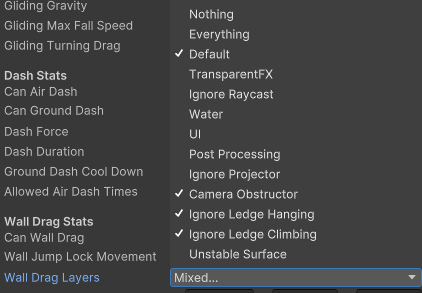

# 蹬墙跳

首先在PlayerStats中添加一些属性

```csharp
[Header("Wall Drag Stats")] 
public bool canWallDrag = true;
public bool wallJumpLockMovement = true;
public LayerMask wallDragLayers;
public Vector3 wallDragSkinOffset;
public float wallDragGravity = 12f;
public float wallJumpDistance = 8f;
public float wallJumpHeight = 15f;
```

在Player/States下新建脚本 WallDragPlayerState

```csharp
public class WallDragPlayerState : PlayerState
{
    protected override void OnEnter(Player entity)
    {
        // 既然要蹬墙跳，那就要重置所有这些空中只能做一次的事情
        entity.ResetJumps();
        entity.ResetAirSpins();
        entity.ResetAirDash();
        // 归零速度
        entity.velocity = Vector3.zero;
        // 下一次跳出的方向是墙面的反方向
        var direction = entity.lastWallNormal;
        direction = new Vector3(direction.x, 0, direction.z).normalized;
        // 面对跳出方向
        entity.FaceDirection(direction);
        // 设置模型偏移量
        entity.skin.position += entity.transform.rotation * entity.stats.current.wallDragSkinOffset;
    }

    protected override void OnExit(Player entity)
    {
        // 退出时要还原模型的偏移量
        entity.skin.position -= entity.transform.rotation * entity.stats.current.wallDragSkinOffset;
        // 判断一下 如果不在地上 且 还有父对象
        if (!entity.isGrounded && entity.transform.parent != null)
        {
            // 在空中时不应该有父节点
            entity.transform.parent = null;
        }
    }

    protected override void OnStep(Player entity)
    {
        // 设置垂直速度，挂墙上的时候会往下溜
        entity.verticalVelocity += Vector3.down * entity.stats.current.wallDragGravity * Time.deltaTime;
        // 如果在地面上 或者 没有检测到前方人物半径内有东西
        if (entity.isGrounded || !entity.CapsuleCast(-entity.transform.forward, entity.radius))
        {
            // idle
            entity.states.Change<IdlePlayerStates>();
        }
        else if (entity.inputs.GetJumpDown()) // 如果检测到按下跳跃键
        {
            // 是否要锁定跳跃控制
            if (entity.stats.current.wallJumpLockMovement)
            {
                entity.inputs.LockMovementDirection();
            }
            // 按规定方向跳跃
            entity.DirectionalJump(entity.transform.forward, entity.stats.current.wallJumpHeight, entity.stats.current.wallJumpDistance);
            // 跳出去后要切换到掉落状态
            entity.states.Change<FallPlayerState>();
        }
    }

    public override void OnContact(Player entity, Collider other)
    {
        
    }
}
```

在Player中实现切换蹬墙跳状态的入口

```csharp
// 上次蹬墙跳的方向
public Vector3 lastWallNormal { get; protected set; }

public virtual void WallDrag(Collider other)
{
    // 如果属性支持，在掉落中，手里没拿东西，碰到的物体不是刚体
    if (stats.current.canWallDrag && velocity.y <= 0 && !holding && !other.TryGetComponent<Rigidbody>(out _))
    {
        // 如果 向前发射胶囊体射线，检测是是规定layer中的东西 且 没有检测到边缘
        if (CapsuleCast(transform.forward, 0.25f, out var hit, stats.current.wallDragLayers) && !DetectingLedge(0.25f, height, out _))
        {
            // 如果碰到的物体时platform
            if (hit.collider.CompareTag(GameTags.Platform))
            {
                // 设置父对象
                transform.parent = hit.transform;
            }
            // 记录法线方向
            lastWallNormal = hit.normal;
            states.Change<WallDragPlayerState>();
        }
    }
}

public virtual void DirectionalJump(Vector3 direction, float height, float distance)
{
    // 蹬墙跳了，次数+1
    jumpCounter++;
    // 垂直速度增加
    verticalVelocity = Vector3.up * height;
    // 水平速度按照方向增加
    lateralVelocity = direction * distance;
    playerEvents.OnJump?.Invoke();
}
```

那么什么状态能进入蹬墙跳呢？

AieDive

```csharp
public override void OnContact(Player entity, Collider other)
{
    if (!entity.isGrounded)
    {
        entity.WallDrag(other);
    }
}
```

Backflip，Dash，Fall

```csharp
public override void OnContact(Player entity, Collider other)
{
    entity.PushRigidbody(other);
    entity.WallDrag(other);
}
```

Gliding

```csharp
public override void OnContact(Player entity, Collider other)
{
    entity.WallDrag(other);
}
```

还记得PlayerCamera中的这个函数吗？这里进行完善

```csharp
protected virtual bool VerticalFollowingStates()
{
    return player.states.IsCurrentOfType(typeof(SwimPlayerState)) ||
            player.states.IsCurrentOfType(typeof(WallDragPlayerState)) ||
            player.states.IsCurrentOfType(typeof(LedgeHangingPlayerState)) ||
            player.states.IsCurrentOfType(typeof(LedgeClimbingPlayerState)) ||
            player.states.IsCurrentOfType(typeof(RailGrindPlayerState));
}
```

在Lily预制体中，第6个状态是蹬墙跳。

同时要改变持久化的Stats，如图所示选择蹬墙跳适用的layer



运行即可实现蹬墙跳。