# 设置状态机

上文中，我们在Player里面加了一个属性stats，那么它从哪来呢？
引用上文内容：

```csharp
// 这就是实体的属性，只不过我们特化了Player，以后怪物是不是也会有这个属性呢？
public PlayerStatsManager stats { get; protected set; }
// 在下一节中我们要围绕它来实现这些stats里面的内容，毕竟我们要用属性，就得给他设计很多属性。
```

我们打开EntityStatsManager

```csharp
public abstract class EntityStatsManager<T> : MonoBehaviour where T : EntityStats<T>
{
    // 就是说每个实体它都有一些属性，那么这个管理类就要包含它的这些属性。
    public T[] stats;
    public T current { get; protected set; }

    // 这就是改变属性，但是在之后很久我们都不会用到它，先不用理解它了，等用到的时候再回来看
    public virtual void Change(int to)
    {
        if (to >= 0 && to < stats.Length)
        {
            if (current != stats[to])
            {
                current = stats[to];
            }
        }
    }
    // 那么当前的属性默认就是数组第一个
    protected void Start()
    {
        if (stats.Length > 0)
        {
            current = stats[0];
        }
    }
}
```

此时我们在WalkPlayerState里面写的那个判断的东西，就要起作用了。\
我们要在这里设置它的移动速度阈值。

我们在PlayerStats里面添加这些代码

```csharp
public class PlayerStats : EntityStats<PlayerStats>
{
    // 人物移动的速度阈值，转向时的阻力，走路时的加速度等等属性，这些属性影响人物操作的手感，可以自己后期进行调试。
    // 这里暴露给Inspector窗口，以便我们后期调试人物移动的手感。当然还会往这里面加很多东西，比如人物的攻击力，防御值这些类似的属性。
    [Header("Motion Stats")] 
    public float brakeThreshold = -0.8f;
    public float turningDrag = 28f; 
    public float acceleration = 13f;
    public float topSpeed = 7.5f; // 按照我写的数值来做，后面就不用修bug了
    public float airAcceleration = 32f;
    [Header("Running Stats")] 
    public float runningAcceleration = 16f;
    public float runningTopSpeed = 9f;
    public float runningTurnnignDrag = 14f;
}
```

我们现在所做的一切都是为了让角色动起来，那么我们已经声明了让他动的函数，现在来填充里面的内容。

打开Player

```csharp
public virtual void Accelerate(Vector3 direction)
{
    // 人物在转身时需要阻力，这样看起来更加平滑真实，那么什么时候能转身呢？肯定是在地面的时候
    // 在地面上转身又分为走路和跑步，那跑的时候转身肯定和走的时候不一样，我们就需要用到上文设置好的系数了。
    var turningDrag = isGrounded && inputs.GetRun() ? stats.current.runningTurnnignDrag : stats.current.turningDrag;
}
```

系数是有了，那什么时候在地面上呢？

我们打开Entity，在其中添加

```csharp
public bool isGrounded { get; protected set; } = true; // 默认在地面上
```

这个属性帮我们确定实体是否在地面上。

那么既然有跑的动作，我们就要在PlayerInputManager中加上这个InputAction\
同时，我们要有一个函数来获取人物到底有没有在跑。

```csharp

protected InputAction m_run;

protected virtual void CacheActions()
{
    m_movement = actions["Movement"];
    // 我们加入Run这个操作。
    m_run = actions["Run"];
}

public virtual bool GetRun()
{
    return m_run.IsPressed();
}

public virtual bool GetRunUp()
{
    return m_run.WasReleasedThisFrame();
}
```

**注意：我们现在并没有在InputActions配置文件里面绑定Run的操作，等一会我们来绑定它。如果你用的是给的那个文件就不用绑了**

好的，现在转身的这个拖拽力算出来了，那我们开始算下面的值。

**这里一定要仔细看看，理解一下怎么转向，怎么加速**

在Player中：

```csharp
// 有道翻译 Accelerate 是 加速度
public virtual void Accelerate(Vector3 direction)
{
    // 人物在转身时需要阻力，这样看起来更加平滑真实，那么什么时候能转身呢？肯定是在地面的时候
    // 在地面上转身又分为走路和跑步，那跑的时候转身肯定和走的时候不一样，我们就需要用到上文设置好的系数了。
    var turningDrag = isGrounded && inputs.GetRun() ? stats.current.runningTurnnignDrag : stats.current.turningDrag;
    // 加速度，在地面上时人物的加速度应当是多少？这取决于人物是否在跑，当然这里的数值都在PlayerStats中预设好了，之后还可以通过Inspector窗口去修改。
    var acceleration = isGrounded && inputs.GetRun() ? stats.current.runningAcceleration : stats.current.acceleration;
    // 最高的速度，速度当然是要变化的，不管是跑步还是走路都要加速，随后才能到达最高的速度，它要有一个过程。当然，人物移动的速度是有极限的。
    var topSpeed = inputs.GetRun() ? stats.current.runningTopSpeed : stats.current.topSpeed;
    // 最终加速度，那如果人物不在地面上，在空中时要采用空中的加速度，这时和之前计算出的加速度进行一次判断，到底是在空中，还是在地面。
    var finalAcceleration = isGrounded ? acceleration : stats.current.airAcceleration;
    // 我们只算出来这些数据是不够的，那既然要模拟这个由慢到快的过程，就需要更详细的去写，所以再来一个函数。
    Accelerate(direction, turningDrag, finalAcceleration, topSpeed);
}

public virtual void Accelerate(Vector3 direction, float turningDrag, float acceleration, float topSpeed)
{
    // 同样的，由于算这些数据很费劲啊，如果输入的移动方向无效的话就不要算了

    // 要注意的是，一层一层往上看，我们传进来的这个direction是个单位向量，而且它的y值是0，也就是说它实际上是我们要达到的目标朝向。
    // 但是我们就一定要转到direction所指的方向去吗？
    // 不是的，我们只是目标是这个方向，然后给人物这个方向的加速度，让人物自己去转动，一旦我们的输入停止，加速度就不加了，这样它就可以平滑的转向移动了。

    if (direction.sqrMagnitude > 0)
    {
        // 这个speed是direction与侧向速度的点积，很容易发现两个向量的y值都是0，所以得到的speed实际上是xz面上这两个向量夹角的余弦值。
        // 这个余弦值 如果 等于-1，说明这两个向量方向相反，如果等于1，则说明它们方向相同，如果等于0，则说明是垂直的。
        // 这个lateralVelocity是侧向速度，它的方向代表惯性的方向，它的模长代表在这个方向上的速度。
        var speed = Vector3.Dot(direction, lateralVelocity);
        // 我这里没跟课程一样，我把这个变量命名为newVelocity，不要跟我们在类里声明的velocity重名，目的是方便理解这个velocity到底是什么东西。光说这个速率太朦胧太模糊了。
        // 我们这个新变量很容易看出来就是：传入的方向向量 * 算出的余弦值 实际上就是往这个方向加了长度。
        // 那你很容易看出来，direction是单位向量，乘以speed，也就是说newVelocity就是在输入方向上的速度，它的模长代表它在这个方向上的速度值。
        // 假设我们要转个小弯，那这个newVelocity实际上就是我们在新的方向上获得的速度向量。
        var newVelocity = direction * speed;
        // 这就很简单了，就是算了一个新向量出来，因为你毕竟要转向到新的方向上去，你得有个转的方向。
        var turningVelocity = lateralVelocity - newVelocity;
        // 这是转向的阻力衰减，这和后面的Vector3.MoveTowards有关系，目的是平滑衰减
        var turningDelta = turningDrag * turningDragMultiplier * Time.deltaTime;
        // 目标最高速度，最高速度乘倍乘系数
        var targetTopSpeed = topSpeed * topSpeedMultiplier;

        // lateralVelocity.magnitude相当于lateralVelocity向量的模长，越长代表侧向速度越快
        // 让它和最高速度进行比较，如果没有到最高速度或者它在倒退时（speed < 0 说明新的方向在原来方向的反方向）
        if (lateralVelocity.magnitude < targetTopSpeed || speed < 0)
        {
            // 让speed进行变化，每次变化的数值就是我们计算好的加速度乘以倍乘系数再乘以每一帧的时间间隔。
            // 说简单点就是 速度 = 加速度 * 时间 这里的时间是每一帧的时间。
            speed += acceleration * accelerationMultiplier * Time.deltaTime;
            // 这里目的是将speed钳制在这个给定的范围内，不能超出最高速度，有正负号的原因是速度是有方向的。
            speed = Mathf.Clamp(speed, -targetTopSpeed, targetTopSpeed);
        }
        // 由于speed发生了变化，我们需要更改新的方向上的速度
        newVelocity = direction * speed;
        // 平滑处理
        turningVelocity = Vector3.MoveTowards(turningVelocity, Vector3.zero, turningDelta);
        // 计算完成后，我们已经进行了一帧的转向相关的动作，那么此时就要修改一下我们的侧向速度。
        lateralVelocity = newVelocity + turningVelocity;
    }
}
```

`Vector3 MoveTowards (Vector3 current, Vector3 target, float maxDistanceDelta);`:

current：移动的开始位置。\
target：移动的目标位置。\
maxDistanceDelta：每次调用移动 current 的距离。\
返回 Vector3 新位置。

计算 current 指定的点与 target 指定的点之间的位置，移动距离不超过 maxDistanceDelta 指定的距离。

使用 MoveTowards 成员将 current 位置处的对象移向 target 位置。通过使用此函数计算的位置来更新每个帧的对象位置，您可以平滑地将其移向目标。使用 maxDistanceDelta 参数来控制移动的速度。如果 current 位置相比 maxDistanceDelta 更靠近 maxDistanceDelta，则返回值等于 maxDistanceDelta；新位置不会过冲 maxDistanceDelta。要确保对象速度与帧率无关，请将 maxDistanceDelta 值乘以 Time.deltaTime（或者 FixedUpdate 循环中的 Time.fixedDeltaTime）。

请注意，如果将 maxDistanceDelta 设置为负值，则该函数将返回与 target 相反方向的位置。

这里我们在Entity中加了几个参数，都是一些倍乘系数。

```csharp
// 这玩意是干嘛的，假如我们之后做了一些buff，给人物上了给加速buff，那他转身跑路的速度都得加快，在这里留个口子，到时候改这些系数就行了
public float turningDragMultiplier { get; set; } = 1f;
public float topSpeedMultiplier { get; set; } = 1f;
public float accelerationMultiplier { get; set; } = 1f;
```

## Accelerate的几何意义

好了，现在我们来用几何意义的形式来解释`void Accelerate(Vector3 direction, float turningDrag, float acceleration, float topSpeed)`函数。

首先我们输入了dirction向量，我们知道它是一个单位长度的向量。假设它的方向如图。

其次我们在自身的类成员中有侧向速度lateralVelocity，我们假设它的模长为3，也就是侧向速度为3，方向如图。

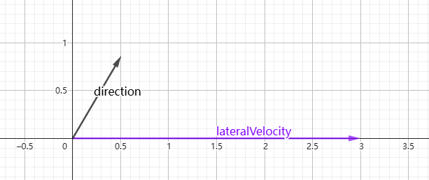

那我们很容易得知，speed是direction向量和lateralVelocity的点积，也就是lateralVelocity在direcion方向上的投影长度。由于我们这里假设lateralVelocity和direcion的夹角小于90度，所以speed是正值。

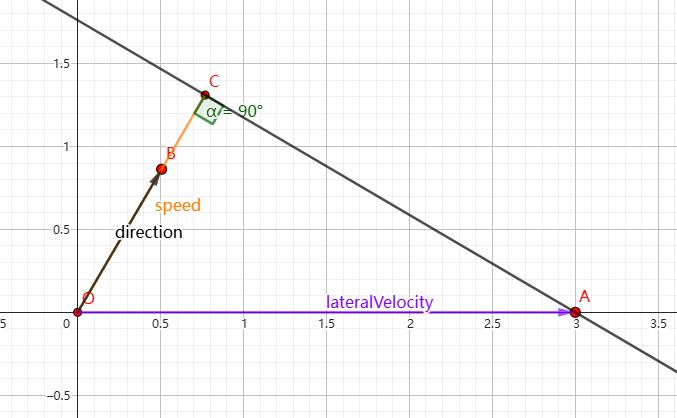

newVelocity = direction * speed

也就是说newVelocity就是方向是direction，模长为speed的向量

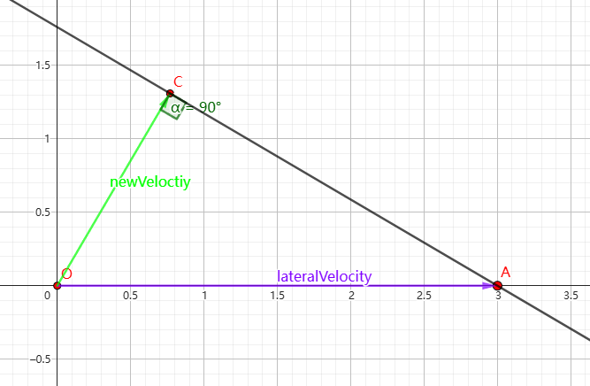

turningVelocity = lateralVelocity - newVelocity

那么向量的减法这里就不说了。

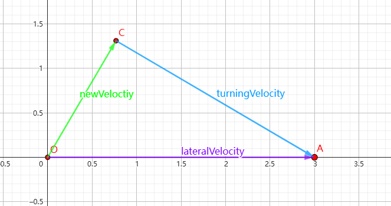


这时候进入判断，我们要求lateralVelocity的模长要小于targetTopSpeed

也就是说lateralVelocity在这个圆内就可以给他速度。

另一个判断条件是speed < 0，这里因为我们之前的假设，speed一定大于0，小于0的情况下面再做说明。

addSpeed就是在判断里第一句，计算了每帧的速度变化，所以加上这一帧变化的速度

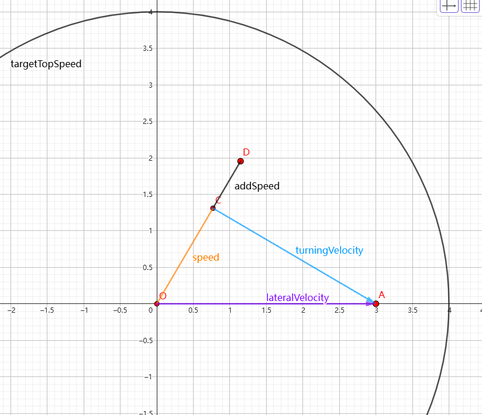

在速度变化后我们对newVelocity进行了重新赋值，那么它的模长要和speed相等。

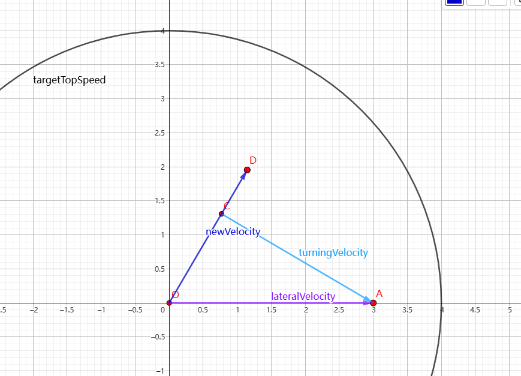

随后进行的是`turningVelocity = Vector3.MoveTowards(turningVelocity, Vector3.zero, turningDelta);`

这句话怎么理解呢？就是让turningVelocity向原点收缩，收缩的值是turningDelta控制的，这个是我们设置的阻力，这样它就可以每帧平滑地向原点收缩。

我们的目的是让它的模长减少，模拟平滑减少的速度。

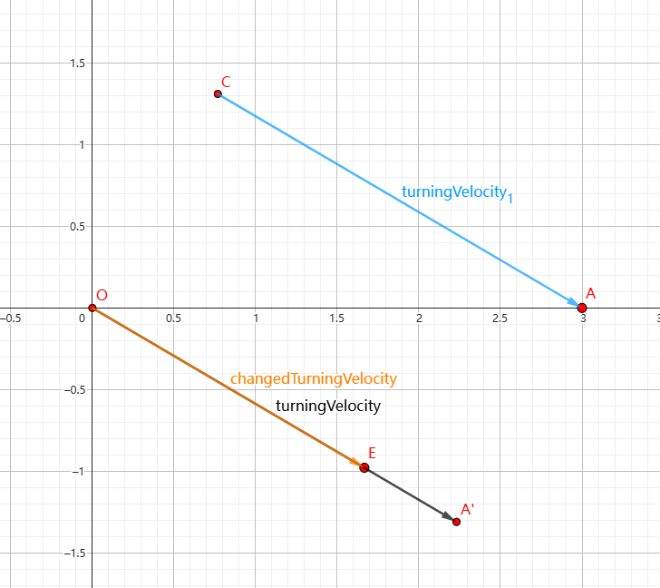

最后我们算出来lateralVelocity并且存到类成员中，也就是改变了目前的侧向速度。

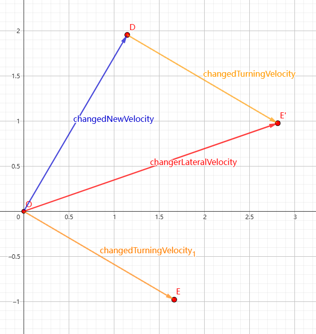

每一帧都这样进行变化，那么转向就会显得真实。

那如果我让direction与lateralVelocity的夹角是钝角，这样算出来的speed就是负值了。

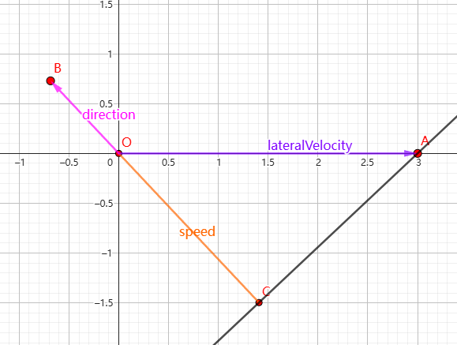

此时得到的newVelocity就与direction的方向相反了

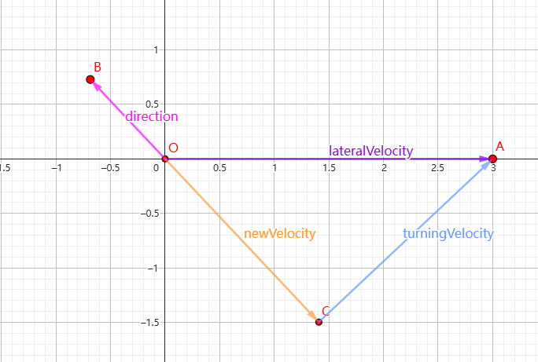

此时因为speed < 0 进入了判断，因为加速度是正的，所以其实负向速度值在降低。

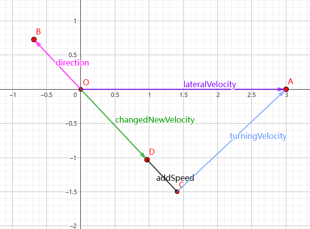

之后的计算与前文相同。

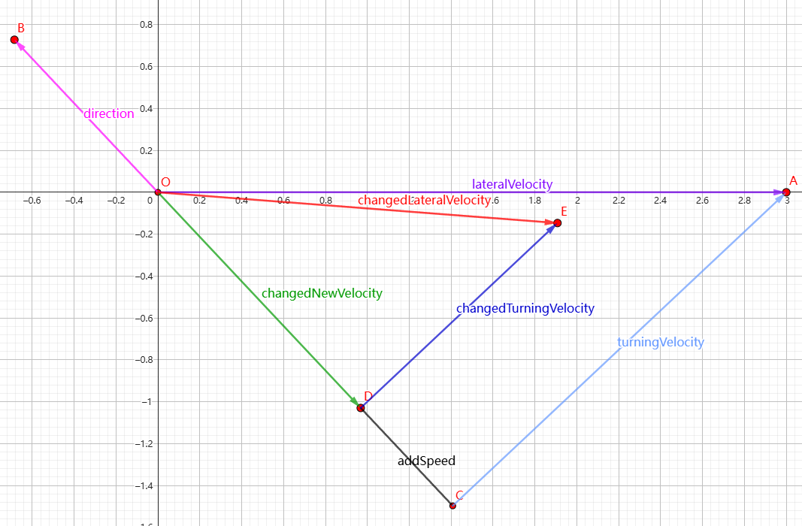

---

到此我们就解读完了这个复杂的函数。