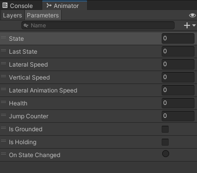

# 人物动作与动画

我们来给人物增加走路的动画，让他移动不那么生硬。

在Scripts\Player下新建脚本PlayerAnimator

在其中添加如下代码：

```csharp
public class PlayerAnimator : MonoBehaviour
{
    [System.Serializable]
    public class ForcedTransition
    {
        // 切换状态时是从哪个状态机来的
        public int fromStateId;
        // 哪一个动画层
        public int animatorLayer;
        // 要变到哪个动画
        public string toAnimationState;
    }

    // 用字典来保存
    protected Dictionary<int, ForcedTransition> m_forcedTransisions;

    protected Player m_player;
    // 拿到animator来播放动画。
    public Animator animator;

    protected virtual void InitializePlayer()
    {
        m_player = GetComponent<Player>();
        // 这里弄一个委托，在动画变化的时候加入HandleForcedTransitions函数监听。
        m_player.states.events.onChange.AddListener(HandleForcedTransitions);
        // 要注意UnityEvent和 C# 中event的不同
    }
    
    protected void Start()
    {
        InitializePlayer();
    }
    // 动画变化时执行的函数
    protected virtual void HandleForcedTransitions()
    {
        // 这里需要知道它最后一个状态是什么。这里获取它的索引。
        var lastStateIndex = m_player.states.lastIndex;

        if (m_forcedTransisions.ContainsKey(lastStateIndex))
        {
            var layer = m_forcedTransisions[lastStateIndex].animatorLayer;
            animator.Play(m_forcedTransisions[lastStateIndex].toAnimationState, layer);
        }
    }
}
```

在EntityStateManager中，添加事件

```csharp
public abstract class EntityStateManager : MonoBehaviour
{
    // 声明一个状态事件，在状态变化时要调用事件
    // 目的是为了降低耦合性，与业务做分离。
    public EntityStateManagerEvents events;
}

public abstract class EntityStateManager<T> : EntityStateManager where T : Entity<T>
{
    // 补充获取最后状态的索引值。因为last我们已经定义过了，所以直接用它来获得索引就好了。
    public int lastIndex => m_list.IndexOf(last);
}
```

我们没有EntityStateManagerEvents类，于是我们在Scripts\Entity下新建脚本EntityStateManagerEvents

```csharp
[System.Serializable]
public class EntityStateManagerEvents
{
    // 切换动画时的事件
    public UnityEvent onChange;
    // 进入动画时的事件
    public UnityEvent<Type> onEnter;
    // 退出动画时的事件
    public UnityEvent<Type> onExit;
}
```

---

这个脚本是围绕着Animator进行制作的，它的目的是为了在不同的状态下切换动画。\
我们可以打开unity中的animator窗口，看看动画机里面都有什么属性。\
可以看到如图所示：



这里面共有十个属性，我们要通过代码来修改它们以配合人物当前的状态。\
这里我就直接贴上课程结尾时的代码，不一步一步来了。

```csharp
public class PlayerAnimator : MonoBehaviour
{
    [System.Serializable]
    public class ForcedTransition
    {
        // 切换状态时是从哪个状态机来的
        public int fromStateId;
        // 哪一个动画层
        public int animatorLayer;
        // 要变到哪个动画，注意，这里是string类型，对应的是动画机里面的状态名称
        public string toAnimationState;
    }

    // 与动画机中相对应的变量名
    [Header("Parameters Names")] 
    public string stateName = "State";
    public string lastStateName = "Last State";
    public string lateralSpeedName = "Lateral Speed";
    public string verticalSpeedName = "Vertical Speed";
    public string lateralAnimationSpeedName = "Lateral Animation Speed";
    public string healthName = "Health";
    public string jumpCounterName = "Jump Counter";
    public string isGroundedName = "Is Grounded";
    public string isHoldingName = "Is Holding";
    public string onStateChangedName = "On State Changed";

    // 这里是我们实际上参与运行的一些变量
    [Header("Settings")] 
    // 最短动画速度
    public float minLateralAnimationSpeed = 0.5f;
    // 这是我们的动画列表，等一会要在Unity中给它添加一些内容
    public List<ForcedTransition> forcedTransitions;
    //上面的十个属性对应的十个hash，用来切换到确切的动画状态
    protected int m_stateHash;
    protected int m_lastStateHash;
    protected int m_lateralSpeedHash;
    protected int m_verticalSpeedHash;
    protected int m_lateralAnimationSpeedHash;
    protected int m_healthHash;
    protected int m_jumpCounterHash;
    protected int m_isGroundedHash;
    protected int m_isHoldingHash;
    protected int m_onStateChangedHash;
    // 动画状态的字典，键是fromStateId，值是对应的ForcedTransition。
    protected Dictionary<int, ForcedTransition> m_forcedTransisions;

    protected Player m_player;

    public Animator animator;

    protected void Start()
    {
        // 初始化这些东西
        // 先进入这个函数看看它都干了什么
        InitializePlayer();
        // 同样的，再进入这个函数看看它干了些什么
        InitializedForcedTransitions();
        // 哈希变量的初始化
        InitializedParametersHash();
        // 初始化触发
        InitializedAnimatorTrigger();
        // 随后我们去看LateUnpdate
    }

    protected virtual void InitializePlayer()
    {
        // 初始化Player，从资深获取Player脚本。
        m_player = GetComponent<Player>();
        // 在Player的States进行改变时，我们的动画也要做相应的改变。所以要改变什么呢？我们进入HandleForcedTransitions函数。
        m_player.states.events.onChange.AddListener(HandleForcedTransitions);
    }

    protected virtual void InitializedForcedTransitions()
    {
        // 首先我们的字典是没有初始化的，它是空的，所以我们必须new一个用。
        m_forcedTransisions = new Dictionary<int, ForcedTransition>();
        // 遍历我们在Unity中设置好的这个list，看看里面有没有有用的信息
        foreach (var transition in forcedTransitions)
        {
            // 如果我们的字典里面不包含这个动画状态，那就把它加入进去。
            if (!m_forcedTransisions.ContainsKey(transition.fromStateId))
            {
                m_forcedTransisions.Add(transition.fromStateId, transition);
            }
        }
    }

    protected virtual void InitializedParametersHash()
    {
        // 对应的将animator中变量的名称都转换成哈希值，方便我们后续使用
        m_stateHash = Animator.StringToHash(stateName);
        m_lastStateHash = Animator.StringToHash(lastStateName);
        m_lateralSpeedHash = Animator.StringToHash(lateralSpeedName);
        m_verticalSpeedHash = Animator.StringToHash(verticalSpeedName);
        m_lateralAnimationSpeedHash = Animator.StringToHash(lateralAnimationSpeedName);
        m_healthHash = Animator.StringToHash(healthName);
        m_jumpCounterHash = Animator.StringToHash(jumpCounterName);
        m_isGroundedHash = Animator.StringToHash(isGroundedName);
        m_isHoldingHash = Animator.StringToHash(isHoldingName);
        m_onStateChangedHash = Animator.StringToHash(onStateChangedName);
    }

    protected virtual void InitializedAnimatorTrigger()
    {
        // 在状态变化时，我们要切换动画的状态，所以给它加入一个监听函数。
        // 这里使用了匿名函数的方式设置了监听函数
        // 它干了什么呢？就是在状态变化时，将动画机中的“onStateChanged”trigger变量改变，达到动画切换的目的。
        m_player.states.events.onChange.AddListener(() => animator.SetTrigger(m_onStateChangedHash));
    }
    
    protected virtual void HandleForcedTransitions()
    {
        // 获取上一个State的索引，这个属性我们已经定义过了
        var lastStateIndex = m_player.states.lastIndex;
        // 如果我们的字典里面有这个状态，即我们可以切换到这个动画时
        if (m_forcedTransisions.ContainsKey(lastStateIndex))
        {
            // 获取动画在哪个层级，这是我们在开头时内部类里面定义的属性。
            var layer = m_forcedTransisions[lastStateIndex].animatorLayer;
            // 在这个层级上播放这个动画
            animator.Play(m_forcedTransisions[lastStateIndex].toAnimationState, layer);
        }
    }

    protected virtual void HandleAnimatorParameters()
    {
        // 侧向速度的动画要随侧向速度的改变而改变，那么就需要拿到它的模长来进行比较
        var lateralSpeed = m_player.lateralVelocity.magnitude;
        // 这里我们用了垂直速度，但是我们没有定义它，其实它和侧向速度一样，等一会我们去定义它
        var verticalSpeed = m_player.verticalVelocity.y;
        // 动画速度也需要进行调整，这里我们根据侧向速度与最高速度的比例进行调整。
        var lateralAnimationSpeed = Mathf.Max(minLateralAnimationSpeed, lateralSpeed / m_player.stats.current.topSpeed);
        // 这里就是设置对应的参数以改变动画了。
        // index我们没有定义，随后定义
        animator.SetInteger(m_stateHash, m_player.states.index);
        animator.SetInteger(m_lastStateHash, m_player.states.lastIndex);
        animator.SetFloat(m_lateralSpeedHash, lateralSpeed);
        animator.SetFloat(m_verticalSpeedHash, verticalSpeed);
        animator.SetFloat(m_lateralAnimationSpeedHash, lateralAnimationSpeed);
        // 这里jumpCounter和holding没有定义，随后进行定义
        animator.SetInteger(m_jumpCounterHash, m_player.jumpCounter);
        animator.SetBool(m_isGroundedHash, m_player.isGrounded);
        animator.SetBool(m_isHoldingHash, m_player.holding);
    }

    protected void LateUpdate()
    {
        // 每一帧最后的时候重新设置一下这些变量，因为动画要随状态的改变而改变，而状态改变是在Update里面进行的，所以这里要在LateUpdate里面去改变动画机的状态，避免动画机状态改变不及时的问题。
        HandleAnimatorParameters();
    }
}
```

首先来到EntityStateManager中，我们对index进行定义

```csharp
// 其实它就是当前状态的索引
public int index => m_list.IndexOf(current);
```

然后我们来到Player中

```csharp
// 这是跳跃计数器
public int jumpCounter { get; protected set; }
// 这个属性判断人物是不是在墙上挂着
public bool holding { get; protected set; }
```

还记得我们之前在Entity中实现的让人物动起来的方法吗？现在我们要用一个更好的东西去实现人物移动。同时我们也要对一些没有定义的东西进行定义。\
打开Entity

```csharp
// Unity提供了角色控制器，我们不妨使用它
public CharacterController controller { get; protected set; }
// 这里定义了垂直速度，我们只用获取或者修改y的值就行了。
public Vector3 verticalVelocity
{
    get { return new Vector3(0, velocity.y, 0);}
    set { velocity = new Vector3(velocity.x, value.y, velocity.z); }
}
// 初始化角色控制器
protected virtual void InitializeController()
{
    // 从挂载该脚本的对象身上拿角色控制器，如果没有那就给他添加一个。
    controller = GetComponent<CharacterController>();
    if (!controller)
    {
        controller = gameObject.AddComponent<CharacterController>();
    }
    // 对它的基础属性进行一些设置
    controller.skinWidth = 0.005f;
    controller.minMoveDistance = 0;
}

protected virtual void Awake()
{
    InitializeStateManager();
    // 别忘了调用初始化函数
    InitializeController();
}
// 我们来修改之前的HandleController
protected virtual void HandleController()
{
    // 如果这个角色控制器启用了，我们就用更好的
    if (controller.enabled)
    {
        // 让角色控制器去控制它移动，之前写的就不需要了。
        controller.Move(velocity * Time.deltaTime);
        return;
    }
    // 没有角色控制器的时候我们还是要用这个
    transform.position += velocity * Time.deltaTime;
}
```

然后我们打开Unity，打开Lily预制体，将PlayerAnimator脚本添加上去，设置Settings下的 ForcedTransitions为1，展开后选择Element 0，设置三个数据为：15，0，Idle。

现在运行，你会发现按shift再按方向键，人物会有跑步的动作了。