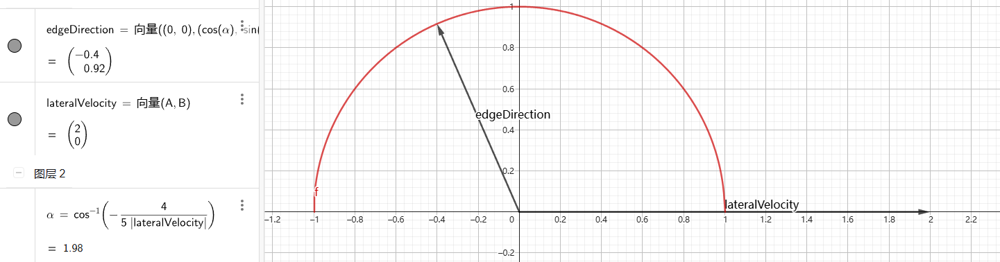

# 人物停止与旋转

现在人物移动的时候按反方向键是没作用的，而且按一下人就自己朝一个方向一直走了，也停不下来。\
同时人物也只是一直面朝一个方向，我们要让他面朝移动方向才对，这就需要旋转人物了。

打开WalkPlayerState

```csharp
// 我们之前写的在 Walk 状态下的函数还需要进一步增加内容
protected override void OnStep(Player entity)
{
    var inputDirection = entity.inputs.GetMovementCameraDirection();

    if (inputDirection.sqrMagnitude > 0)
    {
        // 回到文档2.4中，可以看到对此的解释。
        var dot = Vector3.Dot(inputDirection, entity.lateralVelocity);
        // 这里判断如果点积大于这个阈值，就给角色加速度。
        if (dot >= entity.stats.current.brakeThreshold)
        {
            entity.Accelerate(inputDirection);
            // 我们现在要开始加入旋转相关的功能了，具体的流程其实和Accelerate函数相似，因为player要转身，怪物也要转身，它们的具体实现可能不同，但是底层的逻辑还是一样的。
            entity.FaceDirectionSmooth(entity.lateralVelocity);
        }
    }
}
```

那么我们打开Player，来实现这个函数。

```csharp
// 这里我没有用lamda表达式
public virtual void FaceDirectionSmooth(Vector3 direction)
{ 
    // 要注意这个direction实际上是lateralVelocity
    // rotationSpeed我们没有定义
    FaceDirection(direction, stats.current.rotationSpeed);
}
```

我们先来定义rotationSpeed，打开PlayerStats

```csharp
[Header("General Stats")] 
// 转向速度要高一点，不然转半天转不过来
public float rotationSpeed = 970f;
```

同样的，我们在Entity里面实现通用的这个函数

```csharp
public virtual void FaceDirection(Vector3 direction, float degreesPerSpeed)
{
    // 如果侧向速度不为0
    if (direction != Vector3.zero)
    {
        // 获取当前的朝向，注意这里是四元数
        var rotation = transform.rotation;
        // 我们要让他平滑的转动，那就要算出每帧的转动角度，这里用转动速度 * 每帧时间
        var rotationDelta = degreesPerSpeed * Time.deltaTime;
        // 目标方向就是我们侧向速度的方向，因为平滑转动要随着侧向速度的改变而改变，所以让他绕y轴正方向进行旋转。
        var target = Quaternion.LookRotation(direction, Vector3.up);
        // 这里真正的让他转起来，让当前朝向朝着目标朝向每帧转动rotationDelta的角度进行旋转。
        transform.rotation = Quaternion.RotateTowards(rotation, target, rotationDelta);
    }
}
```

我们来解释一下这个brakeThreshold阈值的作用。\
这个阈值划定了一个区域，只要输入的方向在这个区域内，那么就不能给他加速度，这时就涉及到了等一会要做的人物停止。那什么时候人物停止呢？



可以看到左边的计算公式。\
不难理解，这个范围是要随着lateralVelocity进行变化的，因为它与输入方向的点积大小取决于它们之间的角度和lateralVelocity的模长。模长越长这个区域越大。

那么回到我们的WalkPlayerState中，我们需要在这种情况下让他转换到停止的状态，或者说是刹车的状态。

```csharp
    protected override void OnStep(Player entity)
    {
        var inputDirection = entity.inputs.GetMovementCameraDirection();

        if (inputDirection.sqrMagnitude > 0)
        {
            var dot = Vector3.Dot(inputDirection, entity.lateralVelocity);
            if (dot >= entity.stats.current.brakeThreshold)
            {
                entity.Accelerate(inputDirection);
                entity.FaceDirectionSmooth(entity.lateralVelocity);
            }
            else
            {
                // 到这你应该轻车熟路了，知道该去哪里创建这个状态了。
                entity.states.Change<BrakePlayerState>();
            }
        }
    }
```

在Scripts\Player\States下创建脚本BrakePlayerState

```csharp
public class BrakePlayerState : PlayerState
{
    protected override void OnEnter(Player entity)
    {
    }

    protected override void OnExit(Player entity)
    {
    }

    protected override void OnStep(Player entity)
    {
        // 也就是说我们按了反方向的键要制动了，这就是制动的函数
        entity.Decelerate();
        // 当侧向速度为0的时候，我们要切换到idle的状态，毕竟你都停下来了，总不能一直是刹车的动作吧
        if (entity.lateralVelocity.sqrMagnitude == 0)
        {
            entity.states.Change<IdlePlayerStates>();
        }
    }
}
```

同样的，这个Decelerate函数也和之前的Accelerate、FaceDirectionSmooth一样，要在Player里面封装，通用的函数在Entity中实现

打开Player

```csharp
public virtual void Decelerate()
{
    // 我们既然要刹车了，刹车总得有个力的大小吧。
    // 所以我们需要定义这个deceleration，这是刹车的反向速度，到时候和侧向速度进行抵消。
    Decelerate(stats.current.deceleration);
}
```

我们打开PlayerStats定义这个刹车速度。

```csharp
[Header("Motion Stats")] 
.....
// 在MotionStats下添加
public float deceleration = 28f;
```

随后我们打开Entity来实现刹车的具体逻辑

```csharp
// 这是刹车速度的倍乘系数，为啥要有这些倍乘系数呢？比如你吃到了一个加速buff，那就在这里进行加成，让速度倍乘系数增大，那你的速度也就会相应的增大。这些都是为了后期加入各种功能做的准备。如果你一开始设计的时候就没想到这里，到时候要加入buff功能，是不是就要从最底层开始一个一个加，那就容易乱套了。
public float decelerationMultiplier { get; set; } = 1f;

public virtual void Decelerate(float deceleration)
{
    // 这是每帧要减掉的速度
    var delta = deceleration * decelerationMultiplier * Time.deltaTime;
    // 让侧向速度的模长减少delta，相信你看了前面的文档对这些向量的解释，到这里已经不需要再赘述了。
    lateralVelocity = Vector3.MoveTowards(lateralVelocity, Vector3.zero, delta);
}
```

到这就写差不多了，那我们回到Unity中，打开lily预制体。\
因为我们加了一个状态，所以要在PlayerStateManager中加上这个新写的状态。名字一定不能打错。\
此时运行，你会发现走路的时候角色会进行转动了，按反方向键也会停下了。\
但是还有一个小bug，那就是不按键的时候速度并不会衰减。我们这就来解决它。

那么人在走路的过程中的速度衰减，就需要弄一个摩擦力函数来让他减少。\
所以我们打开WalkPlayerStates

```csharp
    protected override void OnStep(Player entity)
    {
        var inputDirection = entity.inputs.GetMovementCameraDirection();

        if (inputDirection.sqrMagnitude > 0)
        {
            var dot = Vector3.Dot(inputDirection, entity.lateralVelocity);

            if (dot >= entity.stats.current.brakeThreshold)
            {
                entity.Accelerate(inputDirection);
                entity.FaceDirectionSmooth(entity.lateralVelocity);
            }
            else
            {
                entity.states.Change<BrakePlayerState>();
            }
        }
        else
        {
            // 当没有方向输入时，我们就要给他加摩擦力，让他停下来
            entity.Friction();
            // 侧向速度为0时，切换为idle状态。
            if (entity.lateralVelocity.sqrMagnitude <= 0)
            {
                entity.states.Change<IdlePlayerStates>();
            }
        }
    }
```

那么打开Player，我们来实现这个函数

```csharp
public virtual void Friction()
{
    // 这个摩擦力我们没有声明，那就去PlayerStats里面加上
    Decelerate(stats.current.friction);
}
```

打开PlayerStats

```csharp
[Header("General Stats")] 
public float rotationSpeed = 970f;
// 加上摩擦力
public float friction = 16f;
```

同时，在人物idle状态下，我们也要给他加摩擦力，打开IdlePlayerStates

```csharp
protected override void OnStep(Player entity)
{
    // 加上这一行就行了
    entity.Friction();
    .....
}
```

这个时候你再运行，人物走动就很对劲了。\
但是你会发现一走路人物就漂浮在空中了，这是因为我们加入的Character Controller的生成位置的问题。\
我们打开Lily预制体，选择Lily下的子物体Lily，调整它的 position.y 为 -1，就解决了这个问题。

---

**这里对应到课程的14和15节，backflip是后空翻状态，具体制作在课程75节，做了就把brake状态里面的注释掉，brake按照原来的写法先放着。到75节的时候backflip的内容还是需要进行一些修改的，所以做不做都一样。**