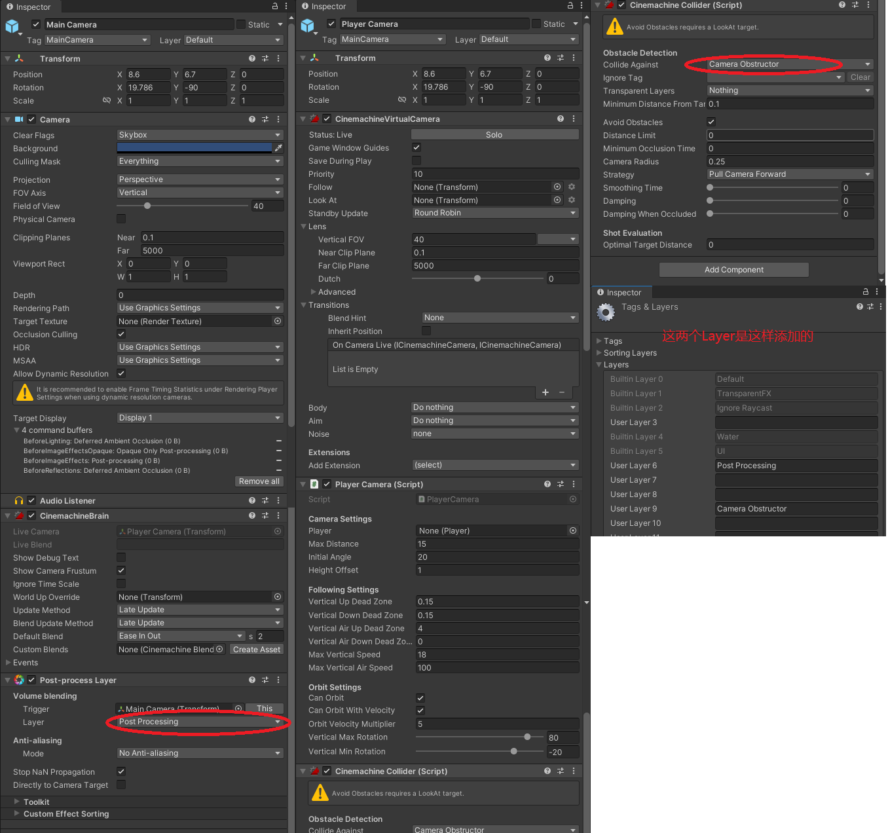

# 相机跟随

这节课涉及到的内容很多，要搞懂写的代码都干了什么很重要。有一些Api也需要了解。

---

打开Unity\
在场景中创建空物体，命名为_CAMERA_，将主摄像机设置为其子对象。\
复制主摄像机，删除里面除了Transform的所有控件，并改名为Player Camera。

点击主摄像机，调整参数：

Field of View = 40；\
Clipping Planes.Near = 0.1;\
Clipping Planes.Far = 5000;\
Depth = 0;

打开 Window -> Package Manager，搜索并安装 Cinemachine 和 Post Processing。

[Cinemachine详细介绍](https://zhuanlan.zhihu.com/p/516625841)\
[Cinemachine案例介绍](https://blog.csdn.net/linxinfa/article/details/124537415)\
[Post Processing的使用](https://blog.csdn.net/yigiwoliao/article/details/122322223)

在主摄像机上挂载 CinemachineBrain 组件。调整 Update Method 为 Late Update。挂载 Post-process Layer 组件。

在Player Camera对象上挂载CinemachineVirtualCamera组件。修改其最后选项，Add Extension，添加Cinemachine Collider。调整其中的参数 Collide Against 为 Nothing， Camera Radius 为 5。调整 Strategy 为 Pull Camera Forward。

在Scripts\Player 下新建脚本 PlayerCamera

```csharp
// 要求使用这个脚本的时候对象上面必须挂载了CinemachineVirtualCamera
[RequireComponent(typeof(CinemachineVirtualCamera))]
public class PlayerCamera : MonoBehaviour
{
    // 先从最后的Start和Update函数看起


    [Header("Camera Settings")]
    // Player对象
    public Player player;
    public float maxDistance = 15f;
    public float initialAngle = 20f;
    public float heightOffset = 1f;

    [Header("Following Settings")] 
    public float verticalUpDeadZone = 0.15f;
    public float verticalDownDeadZone = 0.15f;
    public float verticalAirUpDeadZone = 4f;
    public float verticalAirDownDeadZone = 0f;
    public float maxVerticalSpeed = 18f;
    public float maxVerticalAirSpeed = 100f;

    [Header("Orbit Settings")] 
    public bool canOrbit = true;                // 能不能根据轨道跟随物体
    public bool canOrbitWithVelocity = true;    // 能不能垂直滑动
    public float orbitVelocityMultiplier = 5f;  // 在轨道上滑动的速率倍数

    [Range(0, 90)] 
    public float verticalMaxRotation = 80f;
    [Range(-90, 0)] // 别打错了 
    public float verticalMinRotation = -20f;
    
    // 脚本挂载对象身上的 CinemachineVirtualCamera
    protected CinemachineVirtualCamera m_camera;
    // 为 Cinemachine3rdPersonFollow 添加的 Cinemachine3rdPersonFollow 组件
    protected Cinemachine3rdPersonFollow m_cameraBody;
    // 主相机上添加的 CinemachineBrain
    protected CinemachineBrain m_brain;
    // 摄像机要跟随的点
    protected Transform m_target;
    protected float m_cameraDistance;      // 相机和物体间的距离
    protected float m_cameraTargetYaw;    // 偏航角
    protected float m_cameraTargetPitch;  // 俯仰角
    protected Vector3 m_cameraTargetPosition;

    // 摄像机要跟随的点的名称是什么
    protected string k_targetName = "Player Follower Camera Target";
    
    // 初始化组件
    protected virtual void InitializeComponents()
    {
        // 相机要跟随玩家移动，那就得有个Player，在上面声明
        if (!player)
        {
            // 因为这个游戏里只能有一个Player，所以就直接find获取。
            player = FindObjectOfType<Player>();
        }
        // 获取脚本挂载对象上的 CinemachineVirtualCamera ，变量在上面声明
        m_camera = GetComponent<CinemachineVirtualCamera>();
        // 为 CinemachineVirtualCamera 添加 Cinemachine3rdPersonFollow 组件并保存，变量在上面声明。
        m_cameraBody = m_camera.AddCinemachineComponent<Cinemachine3rdPersonFollow>();
        // 拿到在主相机上添加的 CinemachineBrain 并保存，变量在上面声明
        m_brain = Camera.main.GetComponent<CinemachineBrain>();
    }

    // 初始化跟随操作
    protected virtual void InitializeFollower()
    {
        // 要跟随哪个点。这里有两个变量没有声明，在上面进行声明。
        // 这里是新建了一个对象，也就是说选择 m_target 的位置是不知道在哪里的，要对他初始化才能用。
        m_target = new GameObject(k_targetName).transform;
        // 对它的位置进行初始化，肯定要跟随玩家，那就给他玩家的位置。
        m_target.position = player.transform.position;
    }

    // 初始化相机
    protected virtual void InitializeCamera()
    {
        // 摄像机要跟随哪个点，把我们做好的目标点给他。
        m_camera.Follow = m_target.transform;
        // 让摄像机看向哪个点，摄像机肯定要看向玩家。
        m_camera.LookAt = player.transform;
        // 重置一下摄像机相关参数
        Reset();
    }

    public virtual void Reset()
    {
        // 这里我们没有定义这些变量，在上面定义。
        m_cameraDistance = maxDistance;
        // 初始化相机俯仰角
        m_cameraTargetPitch = initialAngle;
        // 初始化相机偏航角
        m_cameraTargetYaw = player.transform.rotation.eulerAngles.y;
        // 初始化相机跟随目标位置，这里的 unsizePosition 是没定义的，我们在下面展示。
        // 跟随的点就是player未变化高度前的坐标加上一个偏移量。我们不希望蹲下的时候相机也跟着往下突然移动。
        m_cameraTargetPosition = player.unsizePosition + Vector3.up * heightOffset;
        // 让相机先到人物那里去。
        MoveTarget();
        //如果UpdateMode设置为ManualUpdate，则从外部脚本显式调用此方法来更新虚拟摄像机并定位主摄像机。对于其他更新模式，此方法是自动调用的，不应该从其他地方调用。
        m_brain.ManualUpdate();
    }

    // 人物移动了，相机也要跟随移动
    protected virtual void MoveTarget()
    {
        // 设置目标点为相机跟随目标位置
        m_target.position = m_cameraTargetPosition;
        // 设置目标点的旋转参数，转换欧拉角为四元数，输入俯仰角，偏航角，翻滚角默认是0，因为相机不需要左右翻滚。
        m_target.rotation = Quaternion.Euler(m_cameraTargetPitch, m_cameraTargetYaw, 0f);
        // How far baehind the hand the camera will be placed. 摄影机将放置在距离手多远的位置
        m_cameraBody.CameraDistance = m_cameraDistance;
    }

    // 由于这个俯仰角是欧拉角，所以有可能出现转了超过360度的情况。
    protected virtual float ClampAngle(float angle, float min, float max)
    {
        // 要给它限制在 -360~360 之间
        if (angle < -360)
        {
            angle += 360;
        }

        if (angle > 360)
        {
            angle -= 360;
        }
        // 然后再限制它的角度
        return Mathf.Clamp(angle, min, max);
    }
    // 控制相机跟随的轨道 （实际功能是在有鼠标输入时控制相机的旋转与俯仰）
    protected virtual void HandleOrbit()
    {
        // 能不能根据轨道跟随物体
        if (canOrbit)
        {
            // 获取看向的朝向，在下面实现这个函数
            var direction = player.inputs.GetLookDirection();
            // 如果输入方向有效
            if (direction.sqrMagnitude > 0)
            {
                // 判断一下是否使用鼠标进行的输入
                var usingMouse = player.inputs.IsLookingWithMouse();
                // 如果是鼠标输入则返回 timeScale，否则返回 deltaTime
                float deltaTimeMultiplier = usingMouse ? Time.timeScale : Time.deltaTime;
                // 偏航角要和输入的值做加法
                m_cameraTargetYaw += direction.x * deltaTimeMultiplier;
                // 俯仰角做减法，你要做加法那就是反转鼠标上下了。
                m_cameraTargetPitch -= direction.z * deltaTimeMultiplier;
                // 限制俯仰角的范围，限制在俯仰角最小值和最大值之间
                m_cameraTargetPitch = ClampAngle(m_cameraTargetPitch, verticalMinRotation, verticalMaxRotation);
            }
        }
    }
    // 相机偏航变化要随着角色面对的方向进行旋转
    protected virtual void HandleVelocityOrbit()
    {
        // 当 可以通过侧向速度转换 并且 玩家在地面上
        if (canOrbitWithVelocity && player.isGrounded)
        {
            // 把玩家坐标从世界坐标转换到本地坐标
            var localVelocity = m_target.InverseTransformVector(player.velocity);
            // 改变偏航角
            m_cameraTargetYaw += localVelocity.x * orbitVelocityMultiplier * Time.deltaTime;
        }
    }

    protected virtual bool VerticalFollowingStates()
    {
        // 先不管
        return false;
    }
    // 其中用到的一些需要声明的变量就不赘述了，在上面都有声明
    protected virtual void HandleOffset()
    {
        // 获取目标点
        var target = player.unsizePosition + Vector3.up * heightOffset;
        // 记录一下之前的目标点
        var previousPosition = m_cameraTargetPosition;
        // 获取目标的高度
        var targetHeight = previousPosition.y;
        // 如果玩家在地面上 或 能垂直跟踪的状态（之后的功能，现在用不上）
        if (player.isGrounded || VerticalFollowingStates())
        {
            // 目标点的高度 大于 之前的点的高度 + 安全距离（鼠标向上挪动的多了）
            if (target.y > previousPosition.y + verticalUpDeadZone)
            {
                // 算一下偏移量是多少
                var offset = target.y - previousPosition.y - verticalUpDeadZone;
                // 让目标高度加上偏移量
                targetHeight += Mathf.Min(offset, maxVerticalSpeed * Time.deltaTime);
            }
            // 这里如果 鼠标向下挪的多了
            else if (target.y < previousPosition.y - verticalDownDeadZone)
            {
                // 逻辑也是一样的
                var offset = target.y - previousPosition.y + verticalDownDeadZone;
                // 往下看肯定是负的
                targetHeight += Mathf.Max(offset, -maxVerticalSpeed * Time.deltaTime);
            }
            
        }
        // 在空中移动鼠标时，就要使用在空中的一套系数了。这就没什么好说的了，跟上面一样
        else if (target.y > previousPosition.y + verticalAirUpDeadZone)
        {
            var offset = target.y - previousPosition.y - verticalAirUpDeadZone;
            targetHeight += Mathf.Min(offset, maxVerticalAirSpeed * Time.deltaTime);
        }
        else if (target.y < previousPosition.y - verticalAirDownDeadZone)
        {
            var offset = target.y - previousPosition.y + verticalAirDownDeadZone;
            targetHeight += Mathf.Max(offset, -maxVerticalAirSpeed * Time.deltaTime);
        }
        // 最后把算完的值应用到相机的目标点上去
        m_cameraTargetPosition = new Vector3(target.x, targetHeight, target.z);
        
    }

    // 初始化一些参数
    protected void Start()
    {
        // 初始化组件
        InitializeComponents();
        // 初始化跟随操作
        InitializeFollower();
        // 初始化相机
        InitializeCamera();
    }

    // 初始化完事了，我们来看看每一帧都干了些什么
    protected void LateUpdate()
    {
        // 控制相机跟随的轨道
        HandleOrbit();
        // 相机偏航变化要随着角色面对的方向进行旋转
        HandleVelocityOrbit();
        // 计算相机垂直移动的偏移量
        HandleOffset();
        // 改了那么多数据，要应用到相机上面去，让相机进行改变。
        MoveTarget();
    }
}
```

[Cinemachine3rdPersonFollow](https://docs.unity3d.com/Packages/com.unity.cinemachine@2.6/api/Cinemachine.Cinemachine3rdPersonFollow.html)


打开Entity，来定义一些上面用到的变量

```csharp
// 实体的实际高度，因为有些时候实体进行一些动作比如蹲下的时候，高度会变化，这里记录它的原始高度
public float originHeight { get; protected set; }
// 计算实体未变化size的坐标。就是把坐标从当前实体中心调整到原来的实体中心
public Vector3 unsizePosition => position - transform.up * height * 0.5f + transform.up * originHeight * 0.5f;

protected virtual void InitializeController()
{
    ....
    // 我们没有初始化这个变量，要在这个函数里加上
    originHeight = controller.height;
}
```

打开PlayerInputManager，实现一些函数

```csharp
protected InputAction m_look;
protected const string k_mouseDeviceName = "Mouse"

protected virtual void CacheActions()
{
    // 在这个函数里加上
    m_look = actions["Look"];
}

public virtual bool IsLookingWithMouse()
{
    // 判断如果是鼠标输入的值就返回true
    if (m_look.activeControl == null)
    {
        // 说明不是鼠标输入
        return false;
    }
    // 否则看看设备名是不是鼠标
    return m_look.activeControl.device.name.Equals(k_mouseDeviceName);
}

public virtual Vector3 GetLookDirection()
{
    // 获取鼠标返回的值
    var value = m_look.ReadValue<Vector2>();
    // 判断是不是用鼠标进行的输入
    if (IsLookingWithMouse())
    {
        // 是的话就把鼠标输入返回
        return new Vector3(value.x, 0, value.y);
    }
    // 否则返回经过死区计算的值（比如手柄输入）
    return GetAxisWithCrossDeadZone(value);
}
```

---

既然我们要实现通过鼠标移动视角，那就要在PlayerInuputActions配置文件里面加上鼠标的映射，命名为Look。

**场景中的地面，墙面要设置一下Layer，新建Layer，在第9层输入Camera Obstructor，然后把场景中的这些地面墙面设置到这一层中。然后还需要打开Player Camera，设置 Cinemachine Collider 的 Collide Against 为这个新建的层。**

现在运行，相机就能做到跟随了。

如果你的相机很奇怪，按着这个设置进行改动。



这样相机就不会很奇怪了