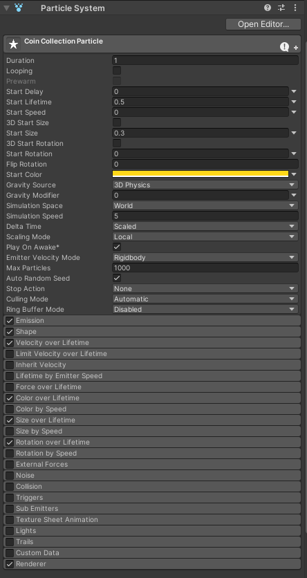
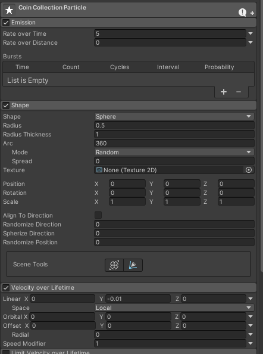
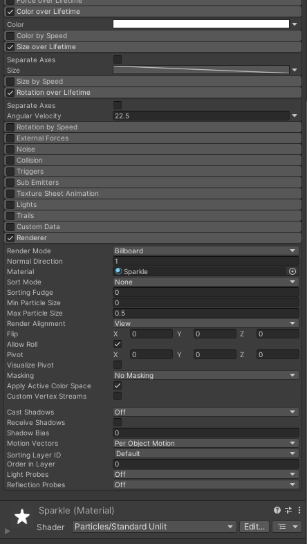
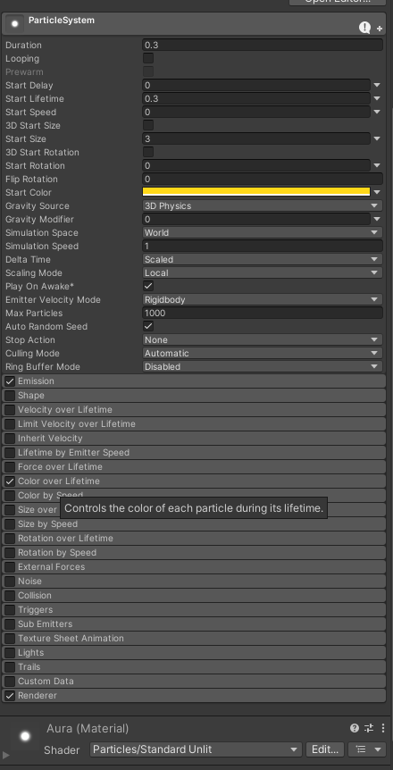
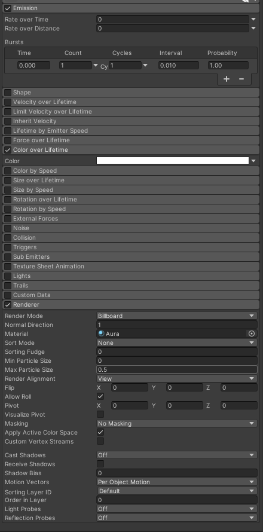
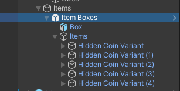
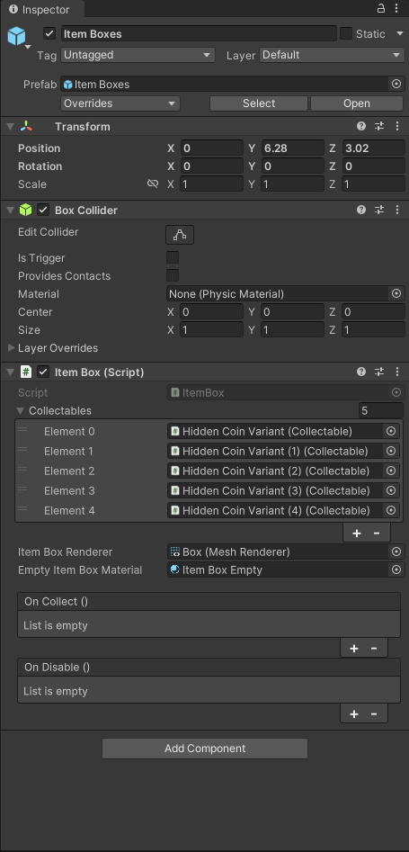
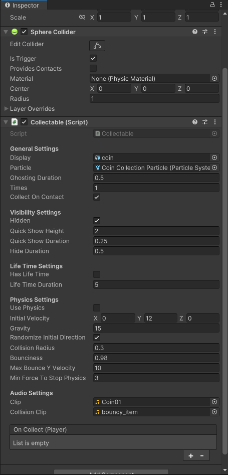

# 金币制作

人物能动了，那就整点金币。

---

如图所示在场景中添加如下物体：


注意在添加物体的时候一定要记得 reset 坐标，在场景中拖动要拖动Item Boxes。

给Coin Collection Particle 和Particle System添加组件 Particle System。

按照图中所示调整参数

Coin Collection Particle:





Particle System:




给Item Box添加Box Collider。

在Scripts下新建文件夹Misc，在其下创建脚本ItemBox 与 Collectable

在Scripts\Entity下创建文件夹Interfaces，在其下创建脚本IEntityContact

IEntityContact:

```csharp
public interface IEntityContact
{
    // 实体接触时要做什么
    public void OnEntityContact(Entity entity);
}
```

ItemBox：

玩过马里奥吗，我们要实现的这个东西就跟马里奥那个金币箱子一个样。

金币装在箱子里，在下面顶他一下金币就弹出来。

那么现在先开始编写箱子的脚本。

```csharp
// 要求必须有boxCollider才能挂载这个脚本
[RequireComponent(typeof(BoxCollider))]
public class ItemBox : MonoBehaviour, IEntityContact // 要继承实体接触的接口
{
    // 看一个类首先要看它在程序运行的时候都干了什么，所以首先去看生命周期函数

    protected BoxCollider m_collider;
    protected Vector3 m_initializeScale;
    public Collectable[] collectables;      // 可收集物列表，在Unity中我们制作预制体的时候可以往里面添加各种道具装在箱子里
    protected bool m_enabled = true;
    public MeshRenderer itemBoxRenderer;
    public Material emptyItemBoxMaterial;

    [Space(15)] 
    public UnityEvent onCollect;
    public UnityEvent onDisable;

    protected int m_index;
    
    // 看看如何初始化可收集物
    protected virtual void InitializeCollectables()
    {
        // 遍历可收集物列表
        foreach (var collectable in collectables)
        {
            // 如果可收集物没有隐藏
            if (!collectable.hidden)
            {
                // 它在箱子里，不能被直接拿到了，让它失活
                collectable.gameObject.SetActive(false);
            }
            else // 隐藏了就把接触收集关掉，因为收集判断的碰撞体比箱子大
            {
                collectable.collectOnContact = false;
            }
        }
    }
    // 收集
    public virtual void Collect(Player player)
    {
        // 如果这个箱子还能被顶，也就是说箱子里还有东西
        if (m_enabled)
        {
            // 我们不是设置了箱子内容物的一个list么，这个工作是等会在Unity里面完成的，假设我们往里面加了五个金币，顶出一个金币index就得+1，所以目前的index不能越界
            if (m_index < collectables.Length)
            {
                // 如果可收集物隐藏了，说明它在箱子里面，那就收集它
                if (collectables[m_index].hidden)
                {
                    collectables[m_index].Collect(player);
                }
                else // 否则激活它
                {
                    collectables[m_index].gameObject.SetActive(true);
                }
                // 最后调整index的值，保证它在正确的范围内
                m_index = Mathf.Clamp(m_index + 1, 0, collectables.Length);
                // 有没有收集事件，有就发送
                onCollect?.Invoke();
            }
            // 如果 index 和数组长度相等了，那说明箱子里东西没有了
            if (m_index == collectables.Length)
            {
                // 关闭箱子，让它不能再被顶了
                Disable();
            }
        }
    }
    // 让箱子不能再被使用了
    public virtual void Disable()
    {
        if (m_enabled)
        {
            m_enabled = false;
            // 换一个材质，箱子能被顶的时候是亮的么，不能被顶的时候就是灰色了
            itemBoxRenderer.sharedMaterial = emptyItemBoxMaterial;
            // 箱子失效有没有事件？有就发送
            onDisable?.Invoke();
        }
    }
    
    // 开始
    protected void Start()
    {
        // 获取到脚本挂载对象身上的BoxCollider
        m_collider = GetComponent<BoxCollider>();
        // 记录初始化的大小
        m_initializeScale = transform.localScale;
        // 初始化 可收集物
        InitializeCollectables();
    }

    // 再来看这个函数，它是继承接口后实现的函数，在实体发生了接触的时候要做什么
    public void OnEntityContact(Entity entity)
    {
        // 首先判断这个接触ItemBox的实体是不是玩家，是玩家才能弹出金币
        if (entity is Player player)
        {
            // 玩家必须从下面跳起来顶这个box才行，所以向上的速度必须大于0，并且接触的地方是箱子的底部。
            // 这里按照课程的代码去写会有bug，如果起跳碰到箱子边缘，会一次触发多个金币，我这里改为必须是玩家的头顶碰到箱子的底部，就不会有这个bug了
            if (entity.velocity.y > 0 && entity.position.y + (entity.height * 0.5f) <= m_collider.bounds.min.y)
            {
                // 那就进行金币的收集
                Collect(player);
            }
        }
    }
}
```

那么我们又设计了一个可收集物，所以我们在Scripts\Misc下新建脚本Collectable

同样的，我们需要先看生命周期函数

```csharp
// 可收集物必须有碰撞体才行
[RequireComponent(typeof(Collider))]
public class Collectable : MonoBehaviour
{
    [Header("General Settings")]
    public GameObject display; // 可收集物的模型，不管是金币还是什么道具都是一样的
    public ParticleSystem particle;
    public float ghostingDuration = 0.5f;
    public int times = 1;
    public bool collectOnContact = true;

    [Header("Visibility Settings")]
    public bool hidden;
    public float quickShowHeight = 2f;
    public float quickShowDuration = 0.25f;
    public float hideDuration = 0.5f;

    [Header("Life Time Settings")] 
    public bool hasLifeTime;
    public float lifeTimeDuration = 5f;

    [Header("Physics Settings")]
    public bool usePhysics;
    public Vector3 initialVelocity = new Vector3(0, 12, 0);
    public float gravity = 15f;
    public bool randomizeInitialDirection = true;
    public float collisionRadius = 0.5f;
    public float bounciness = 0.98f;
    public float maxBounceYVelocity = 10f;
    public float minForceToStopPhysics = 3f;

    [Header("Audio Settings")] 
    public AudioClip clip;
    public AudioClip collisionClip;

    [Space(15)] 
    public PlayerEvent onCollect; // 这里这个PlayerEvent是继承UnityEvent<Player> 的类，我们在下面声明它
    
    protected AudioSource m_audio;
    protected Collider m_collider;
    protected Vector3 m_velocity;
    protected bool m_vanished;
    protected bool m_ghosting = true;
    protected float m_elapsedGhostingTime;
    protected float m_elapsedLifeTime;

    protected const int k_verticalMinRotation = 0;
    protected const int k_verticalMaxRotation = 30;
    protected const int k_horizontalMinRotation = 0;
    protected const int k_horizontalMaxRotation = 360;

    // 初始化音效
    protected virtual void InitializeAudio()
    {
        // 试试能不能拿到音效组件，拿不到就给他添加一个
        if (!TryGetComponent(out m_audio))
        {
            m_audio = gameObject.AddComponent<AudioSource>();
        }
    }
    // 初始化可收集物的碰撞体
    protected virtual void InitializeCollider()
    {
        // 我们就获取到挂载这个脚本的可收集物的碰撞体
        m_collider = GetComponent<Collider>();
        // 设置它为Trigger，因为你不能和player进行实体碰撞，既然要吃这个东西，和触发器碰撞到就行了
        m_collider.isTrigger = true;
    }
    // 初始化位置
    protected virtual void InitializeTransform()
    {
        // 让它在世界坐标下
        transform.parent = null;
        // 对象与世界轴或父轴完全对齐，也就是说归零它的旋转。
        transform.rotation = Quaternion.identity;
    }
    // 初始化展示
    protected virtual void InitializeDisplay()
    {
        // 如果它是藏在箱子里的，hidden = true，那就让它失活
        // 如果它不在箱子里，那就让它显示
        display.SetActive(!hidden);
    }
    // 初始化速率
    protected virtual void InitializeVelocity()
    {
        // 金币被从箱子里面顶出来的时候肯定有一个向上的速度，所以初始化了这个initialVelocity是带有初始值的，如果后期设计了向别的方向飞的可收集物，还可以在Unity中修改它
        // 那既然要向上飞，方向自然要向上，获取向上的单位向量
        var direction = initialVelocity.normalized;
        // 你要向上飞就得有个向上的力，正好就是速率的模长
        var force = initialVelocity.magnitude;
        // 为了让金币飞出来的更加有张力，我们每次顶出来的时候要有一些旋转上的偏移，即你不能让每次金币飞出来的动作都一样吧
        // 所以这里设置一个属性，判断让不让它随机旋转
        if (randomizeInitialDirection)
        {
            // 如果让随机旋转，那就旋转值设个随机数
            var randomZ = UnityEngine.Random.Range(k_verticalMinRotation, k_verticalMaxRotation);
            var randomY = UnityEngine.Random.Range(k_horizontalMinRotation, k_horizontalMaxRotation);
            direction = Quaternion.Euler(0, 0, randomZ) * direction;
            direction = Quaternion.Euler(0, randomY, 0) * direction;
            // 要注意的是随机的旋转改变了金币飞出后运动的方向
        }
        // 设置金币的速率，让金币随机的飞向不同的方向
        m_velocity = direction * force;
    }

    protected virtual void HandleGhosting()
    {
        // 如果在ghosting
        if (m_ghosting)
        {
            // 让 流逝ghosting时间 增加
            m_elapsedGhostingTime += Time.deltaTime;
            // 如果 流逝的ghosting时间 大于等于 设定好的ghosting的时间
            if (m_elapsedGhostingTime >= ghostingDuration)
            {
                // 重置 流逝时间
                m_elapsedGhostingTime = 0;
                // 停止ghosting
                m_ghosting = false;
            }
        }
    }

    public virtual void Vanish()
    {
        // 消失了就拿不到了，就没了
        if (!m_vanished)
        {
            m_vanished = true;
            m_elapsedLifeTime = 0;
            display.SetActive(false);
            m_collider.enabled = false;
        }
    }

    protected virtual void HandleLeftTime()
    {
        // 首先这个物体得有生命时间，没有就说明它不会消失
        if (hasLifeTime)
        {
            // 给 流逝的生命时间增加
            m_elapsedLifeTime += Time.deltaTime;
            // 到达临界值
            if (m_elapsedLifeTime >= lifeTimeDuration)
            {
                // 物体消失
                Vanish();
            }
        }
    }

    protected virtual void HandleMovement()
    {
        // 这里主要是重力影响
        m_velocity.y -= gravity * Time.deltaTime;
    }

    protected virtual void HandleSweep()
    {
        // 首先获取它运动的方向
        var direction = m_velocity.normalized;
        // 然后获取它运动的速度
        var magnitude = m_velocity.magnitude;
        // 计算它一帧要运动的距离
        var distance = magnitude * Time.deltaTime;
        // 发出球形射线，从 transform.position 开始，射线半径为 collisionRadius，射线方向是 direction，获取到碰撞物体 hit，检测距离是 distance，检测场景内哪一层的东西 设置为默认，忽略触发器检测。
        if (Physics.SphereCast(transform.position, collisionRadius, direction, out var hit, distance, Physics.DefaultRaycastLayers, QueryTriggerInteraction.Ignore))
        {  
            // 如果检测到的碰撞体不是玩家 （这里GameTag类没有声明，在下面声明）
            if (!hit.collider.CompareTag(GameTag.Player))
            {
                // 获取碰到这个物体后的反弹方向
                var bounceDirection = Vector3.Reflect(direction, hit.normal);
                // 重新设定速率，因为速率是有方向的，碰到墙上地上等地方要反弹的话就得改变它，bounciness 是衰减的系数
                m_velocity = bounceDirection * magnitude * bounciness;
                // 反弹得有个度，不能说你速度很快一下弹飞了，所以在二者之间取个最小值
                m_velocity.y = Mathf.Min(m_velocity.y, maxBounceYVelocity);
                // 不是player吃了金币，那就播放金币撞墙的音效
                m_audio.Stop();
                m_audio.PlayOneShot(collisionClip);
                // 如果垂直速度到了临界值，我们就得让他停下来了，不能弹个没完没了
                if (m_velocity.y <= minForceToStopPhysics)
                {
                    // 关闭这些物理的计算
                    usePhysics = false;
                }
            }
        }
        // 最后应用一下它的位置改变
        transform.position += m_velocity * Time.deltaTime;
    }

    // 收集函数，还记得我们在ItemBox里面写的Collect吗，如果金币处于在能收集的状态，就要收集它，这里实现具体的逻辑
    public virtual void Collect(Player player)
    {
        // 要收集金币，首先它不能是消失了
        // ghosting 就是在金币从箱子里面爆出来的时候不要立刻能够吃到，直到ghosting结束了才能吃到
        if (!m_vanished && !m_ghosting)
        {
            // 如果是没藏起来的
            if (!hidden)
            {
                // 直接消失
                Vanish();
                // 播放特效（如果有的话）
                if (particle != null)
                {
                    particle.Play();
                }
            }
            else // 如果藏起来了
            {
                // 开启携程展示金币最后的动作
                StartCoroutine(QuickShowRoutine());
            }
            // 开启携程 收集金币
            StartCoroutine(CollectRoutine(player));
        }
    }

    protected virtual IEnumerator CollectRoutine(Player player)
    {
        // 假如你一次要收集多个东西的时候，就需要循环收集，目前这里只收集一个，所以 times 是 1
        for (int i = 0; i < times; i++)
        {
            m_audio.Stop();
            m_audio.PlayOneShot(clip);
            onCollect.Invoke(player);
            yield return new WaitForSeconds(0.1f);
        }
    }
    
    protected virtual IEnumerator QuickShowRoutine()
    {
        // 流逝时间
        var elapsedTime = 0f;
        // 保存金币的位置
        var initializePosition = transform.position;
        // 设定金币要到什么地方去
        var targetPosition = initializePosition + Vector3.up * quickShowHeight;
        // 让金币激活
        display.SetActive(true);
        // 关掉金币的碰撞体
        m_collider.enabled = false;
        // 当流逝时间 小于 展示时间 的时候
        while (elapsedTime < quickShowDuration)
        {
            // 算一下展示的进度
            var t = elapsedTime / quickShowDuration;
            // 让金币朝着目标方向插值移动，每次移动的比例由展示进度控制
            transform.position = Vector3.Lerp(initializePosition, targetPosition, t);
            // 让流逝时间增加
            elapsedTime += Time.deltaTime;
            // 每轮执行一下
            yield return null;
        }
        // 调整金币坐标到目标点
        transform.position = targetPosition;
        // 等待 hideDuration 时间
        yield return new WaitForSeconds(hideDuration);
        // 把金币放回箱子里再让它消失
        transform.position = initializePosition;
        Vanish();

        // 金币收集完了，这个对象就没有用了，所以把它关掉，这里课程里面没有写，我把它加上了
        gameObject.SetActive(false);
    }
    // 一开始的时候我们要初始化场景里面的这些可收集物，我们都要干什么呢？
    protected void Awake()
    {
        // 首先初始化音效，吃金币会有对应的音效
        InitializeAudio();
        // 接下来初始化碰撞体
        InitializeCollider();
        // 初始化它的位置
        InitializeTransform();
        // 初始化展示
        InitializeDisplay();
        // 初始化速率
        InitializeVelocity();
    }
    // 初始化完了，那就得看看怎么使用
    protected virtual void Update()
    {
        // 有的时候金币你长时间不吃就会消失，所以这里判断一下它消失了没有
        if (!m_vanished)
        {
            // 处理幽灵时间
            HandleGhosting();
            // 处理剩余时间
            HandleLeftTime();
            // 如果启用物理效果，也就是这个可收集物会移动，不是固定在一个地方的
            if (usePhysics)
            {
                // 处理移动（主要是重力）
                HandleMovement();
                // 处理滑动相关
                HandleSweep();
            }
        }
    }

    // 这两个是工具函数
    // 判断当Trigger触发时
    protected virtual void OnTriggerStay(Collider other)
    {
        // 如果收集物在接触的状态了，并且接触这个收集物的collider是player
        if (collectOnContact && other.CompareTag(GameTag.Player))
        {
            // 那么就尝试拿到 player，然后进行金币收集
            if (other.TryGetComponent<Player>(out var player))
            {
                Collect(player);
            }
        }
    }
    // 画个线
    protected void OnDrawGizmos()
    {
        if (usePhysics)
        {
            Gizmos.color = Color.green;
            Gizmos.DrawWireSphere(transform.position, collisionRadius);
        }
    }
}
```

在Scripts下新建文件夹Game，在其下新建脚本 GameTags

```csharp
public class GameTags
{
    public static string Player = "Player";
}

```

在Scripts下新建文件夹Events，在其下新建脚本PlayerEvent

```csharp
[Serializable]
public class PlayerEvent : UnityEvent<Player>
{

}
```

然后在Unity中，调整参数如下图所示：

场景中的物体：



ItemBoxes：



Hidden Coin Variant:

