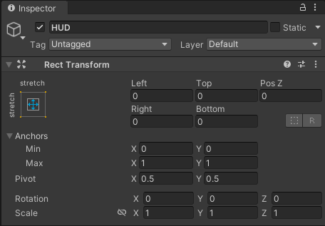
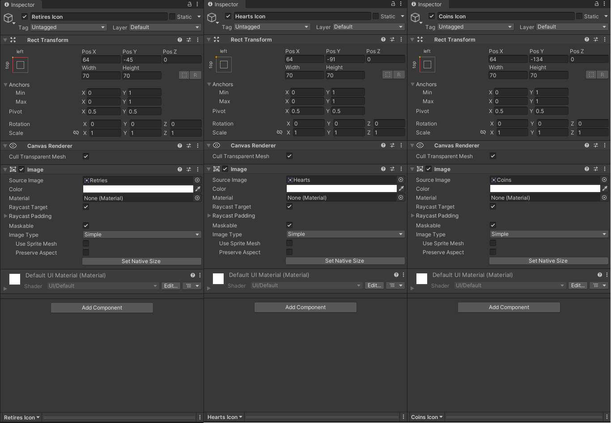
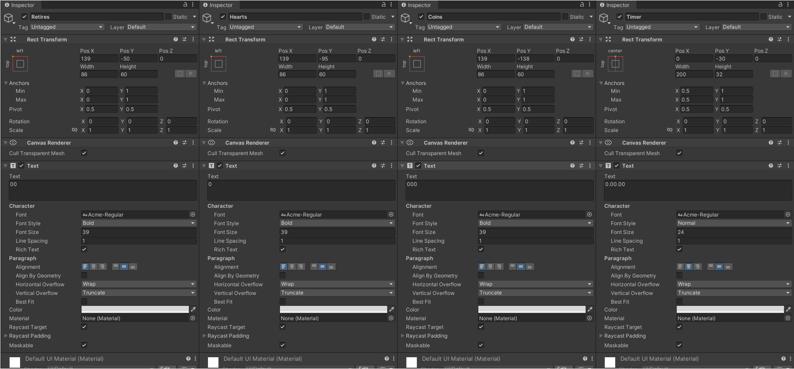
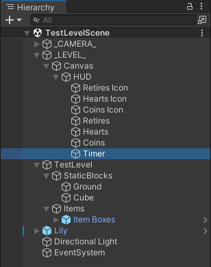
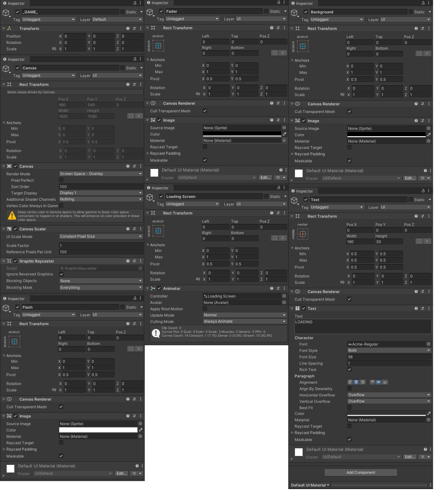
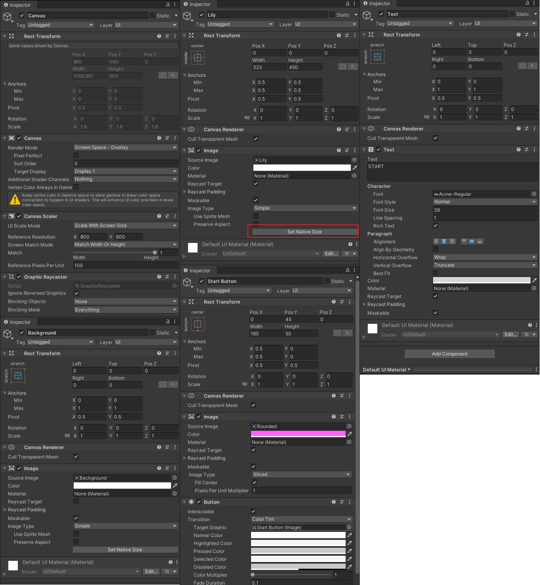

# 游戏界面之主界面

开始拖UI了

在场景中建立空物体，命名为_LEVEL_，在其下创建一个UI -> Canvas，进行如图所示设置：


然后在Canvas上面创建空物体，命名为HUD，并进行如图设置：


随后创建三个image，进行如图设置：


再创建四个UI -> Legacy -> Text，进行如图设置：


现在你的Hierarchy窗口中的结构应该如图所示：


那么UI拖好了，该写代码来控制UI了，在Scripts下新建文件夹UI，并在其下新建脚本HUD

```csharp
public class HUD : MonoBehaviour
{
    public string retriesFormat = "00";
    public string heartsFormat = "0";
    public string coinsFormat = "000";

    [Header("UI Elements")] 
    public Text retires;
    public Text hearts;
    public Text coins;
    public Text timer;

    protected void Awake()
    {
        
    }
}
```

回到Unity中，把该脚本挂载到HUD上面，然后如图所示设置：


---

在Scene下新建场景TitleScreen，进入该场景

新建空物体_GAME_，在其下创建Image，将其命名为Flash，复制Flash，改名为Fader，都为Canvas的子物体。

新建空物体Loading Screen为Canvas的子物体，在Loading Screen下新建Image和Text Legacy，Image命名为 Background 具体设置如图所示：



在场景中新建Canvas，注意要与_GAME_同级，在其下新建Image，命名为Background，再新建Image，命名为Lily，然后新建Button Legacy，命名为Start Button，具体设置如图：



---

在Scripts\Game下新建脚本Game，这是我们的游戏流程控制的核心，它必须是一个单例，即在整个游戏过程中只存在一个对象，通过操作这个对象来控制游戏的流程，比如开始游戏，在游戏中或者结束游戏。

那就需要实现一个单例类，在Scripts\Misc下新建脚本 Singleton

Singleton

```csharp
// 这是继承了MonoBehaviour的单例类，我们可能会有很多这样的管理类，管理游戏流程的，管理怪物刷新的等等
// 单例类的套路就是要有一个私有的静态的实例属性，有一个共有的静态的获取实例的方法，而它本身的构造函数是不能被调用的
// 虽然我们这里没写私有的无参构造，但要是你调用了单例类的构造函数，那就说明你根本不了解单例模式
public class Singleton<T> : MonoBehaviour where T : MonoBehaviour
{
    // 这个泛型是谁呢？是确切的一个管理类的类型，比如我们要管理游戏的流程，那这个泛型就是Game类型，它必然是继承MonoBehaviour的，因为Game类型要继承这个单例类，就相当于是Mono的子类的子类。
    // 私有的实例
    protected static T m_instance;
    // 获取私有实例的方法
    public static T instance
    {
        get
        {
            // 我们知道，在Unity中的类不会调用构造函数，它们在被挂载到场景对象上的时候就会被实例化（也就是Awake的时候），那么我们先看看Awake函数
            // 因为管理类的实例已经产生了，但是我们没有给类中的成员赋值，所以第一次获取肯定是空的
            if (m_instance == null)
            {
                // 既然是单例类，场景中只会有一个这样的对象，那就把它找出来赋值给成员属性，这下就拿到这个单例实例了
                m_instance = FindObjectOfType<T>();
            }

            return m_instance;
        }
    }
    // 要注意子类必须要重写父类的Awake函数
    protected virtual void Awake()
    {
        // 如果场景中存在这个单例了，那就不能再生成实例了，当前Awake就是无效的，要把当前脚本挂载的gameObject删掉，留下场景中唯一的那个挂了管理类的gameObject
        if (instance != this)   // 这里是instance，不是m_instance，因为之前没有获取过instance的时候，m_instance是空的，不能保证场景里没有其他的实例。
        {
            Destroy(gameObject);
        }
    }
}
```

Game

```csharp
// 如你所见，Game就是单例类的一种，所以省的我们一遍遍的去写单例模式了，直接继承单例类就行了
public class Game : Singleton<Game>
{
    // 既然要控制整个游戏的流程，那这个实例就不能被销毁，游戏关闭之前它必须一直存在
    protected override void Awake()
    {
        // 在父类的Awake下，我们要保证这个对象不在场景切换的时候被销毁，加上下面的控制方法。
        base.Awake();
        DontDestroyOnLoad(gameObject);
    }
}

```

---

我们在控制整体流程前，先把主界面相关的控制系统做出来。
在Scripts\Game下新建脚本GameController

```csharp
public class GameController : MonoBehaviour
{
    // 既然要控制流程，那肯定要拿到这个实例
    protected Game m_game => Game.instance;
    // 我们需要制作一个用来换场景的类，显然它也得是一个单例
    protected GameLoader m_loader => GameLoader.instance;
    // 在Controller内实现 场景更换 的方法
    public virtual void LoadScene(string scene) => m_loader.Load(scene);
}
```

在Game下新建脚本GameLoader

```csharp
public class GameLoader : Singleton<GameLoader>
{
    // 在开始加载场景时要发送的事件
    public UnityEvent OnLoadStart;
    // 在加载完成时要发送的事件
    public UnityEvent OnLoadFinish;
    // 既然要加载场景，中间肯定要播放一些动画，我们在下面实现它
    public UIAnimator loadingScreen;
    // 是否在加载了
    public bool isLoading { get; protected set; }
    // 加载进度
    public float loadingProgress { get; protected set; }

    [Header("Minimum Time")] 
    public float startDelay = 1f;   // 开始加载的等待时间
    public float finishDelay = 1f;  // 结束加载的等待时间
    
    public virtual void Load(string scene)
    {
        // 这里使用携程来异步加载场景，减少卡顿
        StartCoroutine(LoadRoutine(scene));
    }

    protected virtual IEnumerator LoadRoutine(string scene)
    {
        // 发送开始加载的时间
        OnLoadStart?.Invoke();
        // 设置为正在加载
        isLoading = true;
        // 将加载时的相关动画激活
        loadingScreen.SetActive(true);
        // 播放相关的动画
        loadingScreen.Show();
        // 真正加载场景前的事情做完后，即动画也开始播放了之后才能取加载场景，避免卡顿
        // 所以这里等一秒
        yield return new WaitForSeconds(startDelay);
        // 异步加载场景
        var operation = SceneManager.LoadSceneAsync(scene);
        // 调整进度
        loadingProgress = 0;
        // 在加载没有完成的时候，每轮调整进度，用来做进度条
        while (!operation.isDone)
        {
            loadingProgress = operation.progress;
            // 一定要记得加上这个，不然程序就会卡在这里
            yield return null;
        }
        // 最后isDone了，进度肯定是100%了，所以在这里更新
        loadingProgress = 1;
        // 完成加载后等待一秒
        yield return new WaitForSeconds(finishDelay);
        // 完成加载，把加载界面关掉并发送完成加载的事件
        isLoading = false;
        loadingScreen.Hide();
        OnLoadFinish?.Invoke();
    }
}
```

那么加载的时候要展示什么呢？在UI下新建脚本UIAnimator

```csharp
// 要求使用这个脚本必须要有Animator，因为既然是UI的动画，那肯定得有动画组件
[RequireComponent(typeof(Animator))]
public class UIAnimator : MonoBehaviour
{
    // 展示时发送的事件
    public UnityEvent OnShow;
    // 隐藏时要发送的事件
    public UnityEvent OnHide;
    // 是否在开始时就隐藏
    public bool hiddenOnAwake;
    // 获取Animator组件
    protected Animator m_animator;

    public string hideTrigger = "Hide";
    public string showTrigger = "Show";

    protected virtual void Awake()
    {
        // 初始化，获取到自身的动画组件以对他操作
        m_animator = GetComponent<Animator>();
        // 如果需要开始时就隐藏它
        if (hiddenOnAwake)
        {
            // 播放隐藏动画
            m_animator.Play(hideTrigger, 0, 1);
        }
    }
    // 激活
    public virtual void SetActive(bool value) => gameObject.SetActive(value);
    // 展示
    public virtual void Show()
    {
        // 改变Show这个Trigger，改变动画状态
        m_animator.SetTrigger(showTrigger);
        OnShow?.Invoke();
    }

    public virtual void Hide()
    {
        // 改变Hide Trigger，改变动画状态
        m_animator.SetTrigger(hideTrigger);
        OnHide?.Invoke();
    }
}
```

那么进入Unity，给_GAME_挂载Game脚本和GameLoader脚本，再给_GAME_下的Loading Screen挂载UIAnimator，勾选 Hidden On Awake，然后拖拽Loading Screen给GameLoader中的Loading Screen

给Canvas挂载GameController脚本。打开Canvas，选择StartButton，在OnClick事件中添加一个事件，将Canvas拖拽给它，在事件中选择执行函数GameController.LoadScene，参数填写FileSelect。

即切换到FileSelect场景。那么我们没有做FIleSelect，接下来就开始做选择存档的场景。