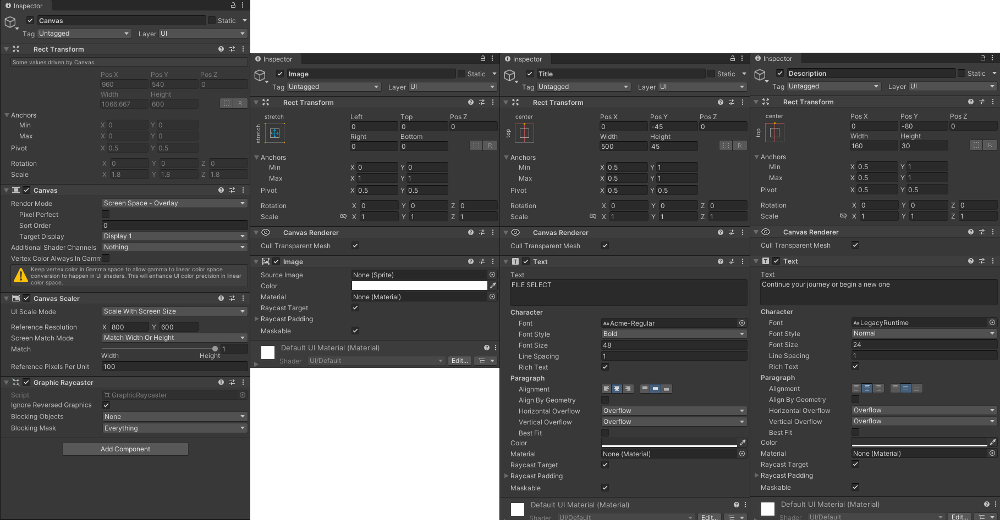
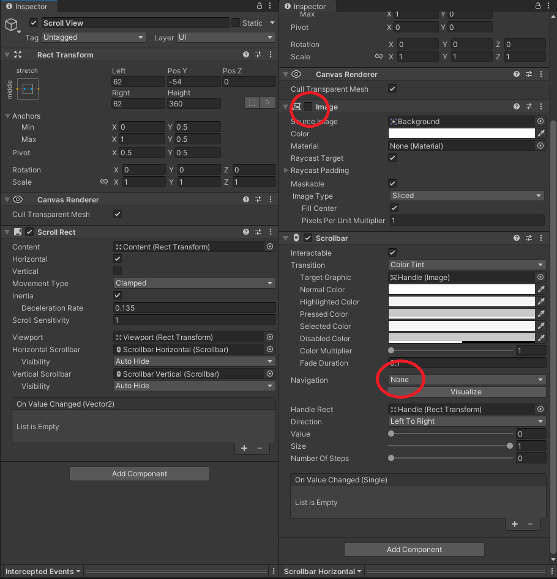
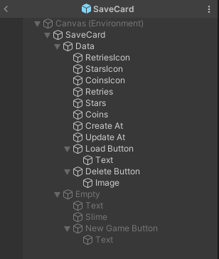
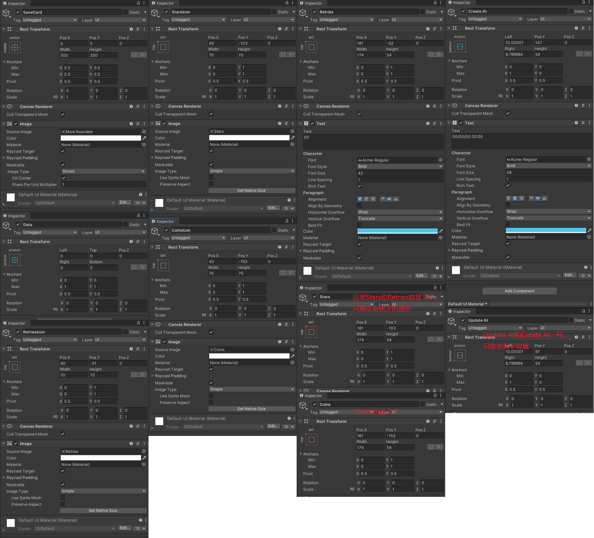
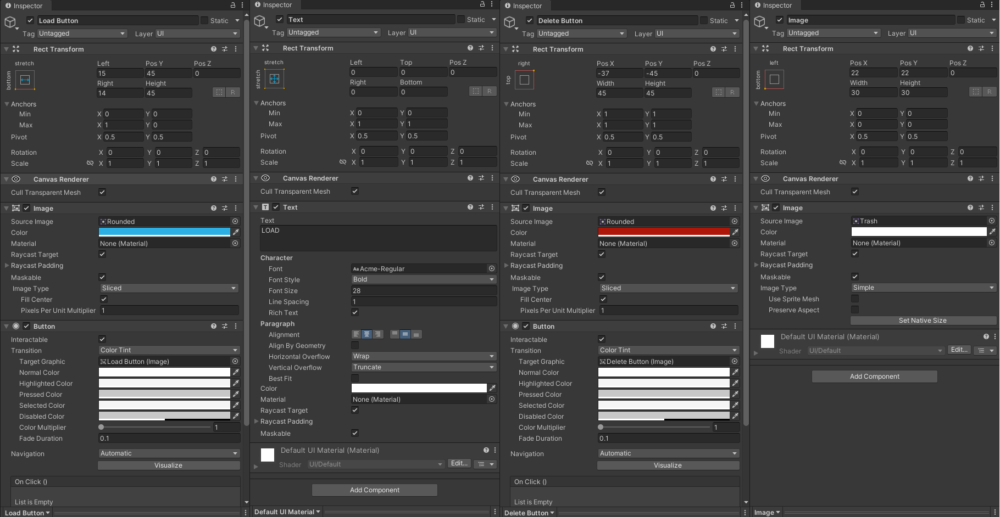
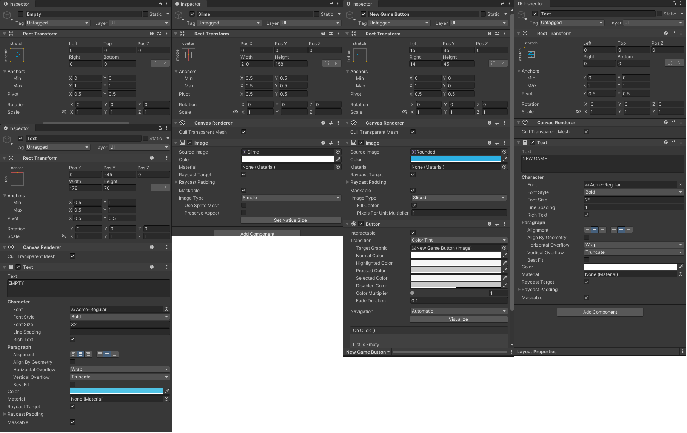

# 游戏界面之存档选择

在Scenes下新建场景FileSelect，并进入这个新场景。

新建一个UI Image，然后在Canvas下新建两个Text Legacy，设置如图：



然后在Canvas下新建Scroll View，设置如下图所示：



这里两个Scroll Bar设置一样，都是按第二张图这样设置。其余没有改动的设置就不贴出来了。

保存场景，切换回TitleScreen。

打开左上角File -> Build Settings，点击Add Open Scenes。

回到FileSelect中，同样的方式添加场景到Build Settings 中。

此时在TitleScreen下运行，点击Start就可以跳转到FileSelect了。
（如果此时有报错，请检查_GAME_是否为失活状态，如果_GAME_的Canvas挡在前面，尝试设置其优先级）

为了我们调试的时候在哪个场景里面都能运行，我们把_GAME_拖成预制体，那就在Prefab文件夹下新建文件夹Global，把_GAME_放进去。然后进入FileSelect，把这个预制体放到场景里面。

然后就是拖UI了。

首先在Prefab文件夹下新建文件夹UI

然后在场景中新建空节点，命名为SaveCard，然后拖到UI文件夹中变成预制体。删掉场景中的SaveCard。

打开这个预制体，按如图所示的结构与参数设置它。







好了，我们的Data就算是拖完了，接下来拖Empty



别忘记保存

---

在Scripts\UI下新建脚本UISaveList，我们要生成一个存档列表，那么这个列表将展示在我们的UI界面上

```csharp
public class UISaveList : MonoBehaviour
{
    // 是否聚焦到第一个元素上
    public bool focusFirstElement = true;
    // 这就是我们刚刚拖了半天的那个存档卡片，当然，它需要一个单独的脚本来控制数据，我们一会再实现它
    public UISaveCard card;
    // 这是在UI上承载这个存档列表的容器
    public RectTransform container;
    // 这就是存档列表
    protected List<UISaveCard> m_cardList = new List<UISaveCard>();

    protected void Awake()
    {
        // 首先，我们要通过一个 保存游戏 的单例类来实现数据的读取与保存，这里既然要把存档显示在UI上，那就是读取数据，当然我们需要读取出来的就是我们的存档内容。
        // 你可以想象一下，我们刚刚拖的UI卡片，每张卡片代表一个存档，那么也就是说我们需要一个列表来存放这些数据，显然data是个列表，至于是什么类型的我们一会再说。
        var data = GameSaver.instance.LoadList();
        // 既然拿到了列表，那就遍历它，把里面的存档数据都显示出来
        for (int i = 0; i < data.Length; i++)
        {
            // 首先我们要把拖好的预制体UI实例化显示在界面上，然后记录它们
            m_cardList.Add(Instantiate(card, container));
            // 然后把数据填充进去
            m_cardList[i].Fill(i, data[i]);
        }
        // 如果需要聚焦在第一个元素上面
        if (focusFirstElement)
        {
            // 假如我们的存档数据里面有东西，说明显示的是继续游戏的那个卡片，那就聚焦到Load Game上面
            if (m_cardList[0].isFilled)
            {
                EventSystem.current.SetSelectedGameObject(m_cardList[0].loadButton.gameObject);
            }
            else    // 这说明没有存档，那就显示的是newGame的按钮，那就聚焦到newGame上面
            {
                EventSystem.current.SetSelectedGameObject(m_cardList[0].newGameButton.gameObject);
            }
        }
    }
}

```

上面说了，我们需要实现这个UISaveCard来实现对UI界面上的卡片数据的控制

在Scripts\UI 下新建脚本UISaveCard

```csharp
public class UISaveCard : MonoBehaviour
{
    // 不管你点了新游戏还是加载游戏，都要切换到下一个场景了，所以这里要知道下一个场景是谁
    public string nextScene;

    [Header("Text Formatting")] // 这是显示在卡片上的信息的格式
    public string retiresFormat = "00";
    public string starsFormat = "00";
    public string coinsFormat = "000";
    public string dateFormat = "MM/DD/YY HH:MM";

    [Header("Containers")] // 这里是记录显示 有数据的卡片 还是 没数据的新游戏卡片
    public GameObject dataContainers;
    public GameObject emptyContainers;
    
    [Header("UI Elements")] // 这里就是对应的UI控件了，到时候挂载这个脚本到卡片预制体上面之后，要把对应的控件拖上
    public Text retires;
    public Text stars;
    public Text coins;
    public Text createAt;
    public Text updateAt;
    public Button loadButton;
    public Button deleteButton;
    public Button newGameButton;

    // 这张卡片在数组里的位置
    protected int m_index;
    // GameData就是游戏的存档类，它规定了存档里面有什么数据
    protected GameData m_data;
    // 当前卡片有没有存档数据
    public bool isFilled { get; protected set; }

    // 这里代表按钮的指令

    public virtual void Load()
    {
        
    }
    
    public virtual void Delete()
    {
        
    }
    
    public virtual void Create()
    {
        
    }

    public virtual void Fill(int index, GameData data)
    {
        
    }
    
    protected void Start()
    {
        // 给这些按钮加监听，具体实现回头再说
        loadButton.onClick.AddListener(Load);
        deleteButton.onClick.AddListener(Delete);
        newGameButton.onClick.AddListener(Create);
    }
}
```

那么如何实现GameData类呢？在Scripts\Game下新建脚本GameData

```csharp
[Serializable] // 注意我们要使用unity提供的序列化类，这里要保存的类必须是可序列化的
public class GameData
{
    public int retries;
    public LevelData[] levels; // 这代表每一关的数据，它又是什么呢？
    public string createdAt;
    public string updateAt;
}
```

在Scripts下新建文件夹Level，在其下新建脚本LevelData

```csharp
[Serializable]
public class LevelData
{
    // 是否被锁住，你下一关没打完的时候下下一关肯定是锁住的，打过的关卡肯定是解锁的
    public bool locked;
    // 你在这一关拿到了多少金币
    public int coins;
    // 你在这一关用了多少时间
    public float time;
    // 你在这一关拿到了几颗星，这里又引出了GameLevel类
    public bool[] stars = new bool[GameLevel.StarsPerLevel];
}
```

在Scripts\Game下新建脚本 GameLevel

```csharp
[Serializable]
public class GameLevel
{
    // 本关是不是被锁住了
    public bool locked;
    // 这一关对应哪个场景
    public string scene;
    // 这一关的名字是什么
    public string name;
    // 这一关的描述是什么
    public string description;
    // 这一关的背景图片
    public Sprite image;
    // 我们固定每一关的星星只有三个
    public static readonly int StarsPerLevel = 3;
    
    public int coins { get; set; }
    public float time { get; set; }
    public bool[] stars { get; set; } = new bool[StarsPerLevel];
}
```

那这个方向延申完了，我们回到UISaveList中，还记得我们要保存游戏数据的时候，写了一个GameSaver的单例类吗

在Scripts\Game下新建脚本 GameSaver

```csharp
public class GameSaver : Singleton<GameSaver>
{
    // 一共能有几个存档，我们设置为5个
    protected static readonly int TotalSlots = 5;
    // 存档序列化的模式是什么
    public enum Mode
    {
        Binary, // 二进制
        JSON, 
        PlayerPrefs 
    }
    // 默认存档序列化的模式是二进制模式
    public Mode mode = Mode.Binary;
    // 默认的存档名字是save
    public string fileName = "save";
    // 默认的存档扩展名是data
    public string binaryFIleExtension = "data";
    
    // 这就是我们在UISaveList里面用到的函数，它返回存档数据
    public virtual GameData[] LoadList()
    {
        // 首先我们读取 5 个存档的话就得有个列表来承载它们
        var list = new GameData[TotalSlots];
        
        for (int i = 0; i < TotalSlots; i++)
        {
            // 每个存档的数据都来读取一下
            var data = Load(i);
            // 如果存档有数据，即存档存在
            if (data != null)
            { // 将存档数据存入列表
                list[i] = data;
            }
        }
        
        return list;
    }
    // 单个的读取
    public virtual GameData Load(int index)
    {
        // 用什么模式读取存档，每个模式都是不一样的。
        switch (mode)
        {
            default:
            case Mode.Binary:
                return LoadBinary(index);
            case Mode.JSON:
                return LoadJson(index);
            case Mode.PlayerPrefs:
                return LoadPlayerPrefs(index);
        }
    }
    // 对应的要有保存
    public virtual void Save(GameData data, int index)
    {
        switch (mode)
        {
            default:
            case Mode.Binary:
                SaveBinary(data, index);
                break;
            case Mode.JSON: 
                SaveJson(data, index);
                break;
            case Mode.PlayerPrefs:
                SavePlayerPrefs(data, index);
                break;
        }
    }

    // 我们读取存档的时候需要获取存档的路径，才能打开对应的文件
    protected virtual string GetFilePath(int index)
    {
        // 如果是json模式，那存档就是json文件，扩展名就是json，否则就按我们默认的来
        var extension = mode == Mode.JSON ? "Json" : binaryFIleExtension;
        // 返回存档路径
        return Application.persistentDataPath + $"/{fileName}_{index}.{extension}";
    }
    // 二进制读取
    protected virtual GameData LoadBinary(int index)
    {
        // 存档路径
        var path = GetFilePath(index);
        // 如果这个文件存在
        if (File.Exists(path))
        {
            // 使用流对存档反序列化，然后返回
            var formatter = new BinaryFormatter();
            var stream = new FileStream(path, FileMode.Open);
            var data = formatter.Deserialize(stream);
            stream.Close();
            return data as GameData;
        }
        // 存档不存在就返回空
        return null;
    }
    // 二进制保存
    protected virtual void SaveBinary(GameData data, int index)
    {
        // 就是反过来序列化
        var path = GetFilePath(index);
        var formatter = new BinaryFormatter();
        var stream = new FileStream(path, FileMode.Create); // 存的时候不能Open，因为有可能这个文件不存在
        formatter.Serialize(stream, data);
        stream.Close();
    }
    
    protected virtual GameData LoadJson(int index)
    {
        // 我这里没跟课程一样写函数序列化反序列化，反正也就一行代码
        // 这里用的是jsonUtility库，需要注意的是jsonUtility库不支持保存字典，所以存档内容里不要有字典类型的东西
        var path = GetFilePath(index);

        if (File.Exists(path))
        {
            var json = File.ReadAllText(path);
            return JsonUtility.FromJson<GameData>(json);
        }

        return null;
    }

    protected virtual void SaveJson(GameData data, int index)
    {
        string json = JsonUtility.ToJson(data);
        var path = GetFilePath(index);
        File.WriteAllText(path, json);
    }
    
    protected virtual GameData LoadPlayerPrefs(int index)
    {
        // PlayerPrefs是Unity提供的存档类型，它是以map的形式保存的，但本质上还是json
        var key = index.ToString();
        
        if (PlayerPrefs.HasKey(key))
        {
            var json = PlayerPrefs.GetString(key);
            return JsonUtility.FromJson<GameData>(json);
        }

        return null;
    }

    protected virtual void SavePlayerPrefs(GameData data, int index)
    {
        var json = JsonUtility.ToJson(data);
        var key = index.ToString();
        PlayerPrefs.SetString(key, json);
        // 要注意的是，使用PlayerPrefs存数据时，只有在游戏关闭的时候才会存到硬盘上。
        // 如果游戏崩溃，那么数据就会丢失，所以要主动的让它进行储存。
        PlayerPrefs.Save();
    }
}

```

好了，到此我们的代码就写了个差不多，现在回到Unity中。

首先打开SaveCard预制体，给SaveCard挂上UISaveCard脚本。Next Scene = LevelSelect，把Data拖给Data Containers，把Empty拖给Empty Containers。然后下面对应的控件拖上去。

回到场景中，给Scroll View拖上 UISaveList脚本，把SaveCard预制体拖到Card上，把ScrollView -> Viewport -> Content拖到Container上。

点击Content，给它添加组件 Horizontal Layout Group，并将Spacing 设置为 10，添加 Content Size Fitter，将两个属性都设置为Min Size。

打开_GAME_预制体，给它挂上脚本GameSaver。

好了，现在运行，你就能看见五个存档卡片显示出来了。我们下一步就要让他们正确的显示出来。

打开UISaveCard，实现里面的函数

```csharp
// 如果没存档，那就要创建存档
public virtual void Create()
{
    // 在GameData里面创建存档
    var data = GameData.Create();
    // 创建完就保存一下
    GameSaver.instance.Save(data, m_index);
    // 然后把创建好的数据填充到存档卡片里面
    Fill(m_index, data);
    // 创建完就要显示data界面了，所以聚焦到loadButton上面
    EventSystem.current.SetSelectedGameObject(loadButton.gameObject);
}
// 填充存档数据
public virtual void Fill(int index, GameData data)
{
    m_index = index;
    // 存档数据是否填充，要看数据是否为空，为空则没有填充
    isFilled = data != null;
    // 对应的，把数据界面和空界面 设置活动状态
    dataContainers.SetActive(isFilled);
    emptyContainers.SetActive(!isFilled);
    // 同样的，设置按钮的可交互性
    loadButton.interactable = isFilled;
    deleteButton.interactable = isFilled;
    newGameButton.interactable = !isFilled;
    // 如果有数据，那就得显示到UI上
    if (data != null)
    {
        m_data = data;
        // 这里都是data.retries肯定是有问题的，我们后面再来改它
        retires.text = data.retries.ToString(retiresFormat);
        stars.text = data.retries.ToString(starsFormat);
        coins.text = data.retries.ToString(coinsFormat);
        createAt.text = DateTime.Parse(data.createdAt).ToString(dateFormat);
        updateAt.text = DateTime.Parse(data.updateAt).ToString(dateFormat);
    }
}
```

那么在GameData里面如何创建存档数据呢？打开GameData

```csharp
// 创建存档数据
public static GameData Create()
{
    // new 一个新的存档出来
    return new GameData()
    {
        // 这里的retries是在Game里面定义的
        retries = Game.instance.initialRetries,
        createdAt = DateTime.UtcNow.ToString(),
        updateAt = DateTime.UtcNow.ToString(),
        // 同样的，关卡也是在Game里面定义的
        levels = Game.instance.levels.Select((level) =>
        {
            return new LevelData()
            {
                locked = level.locked
            };
        }).ToArray()
    };
}
```

打开Game，新增一些需要初始化并显示的数值

```csharp
public class Game : Singleton<Game>
{
    public UnityEvent<int> OnRetriesSet;
    public int initialRetries = 3;
    protected int m_retries;

    public int retries
    {
        get { return m_retries; }
        set
        {
            m_retries = value;
            OnRetriesSet?.Invoke(m_retries);
        }
    }

    public List<GameLevel> levels;

    protected override void Awake()
    {
        base.Awake();
        retries = initialRetries;
        DontDestroyOnLoad(gameObject);
    }
}
```

现在运行，点击newGame，就能创建出一个新存档了，再次运行时就能看到已经保存下来了。