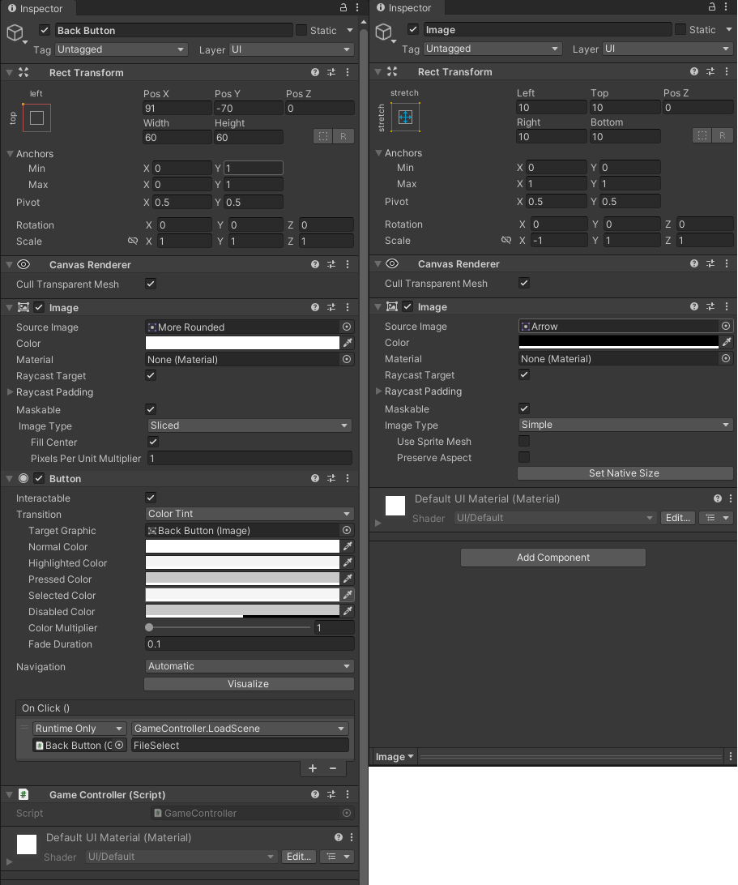
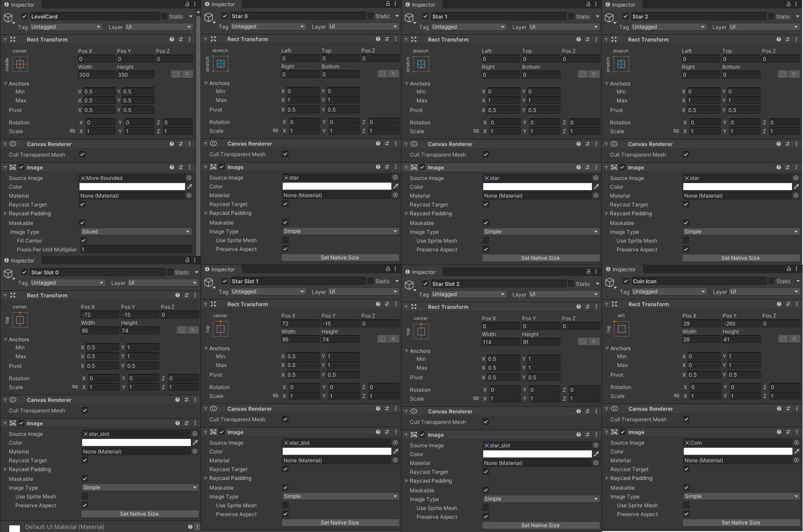
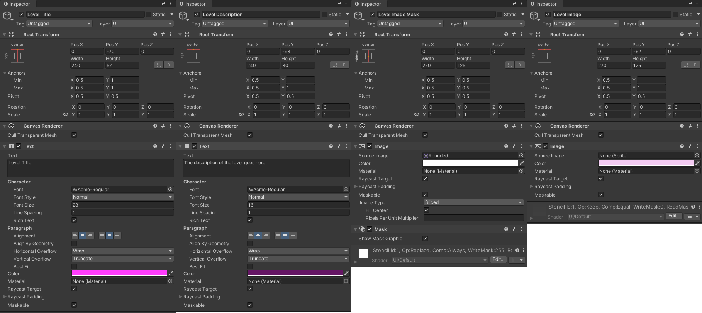
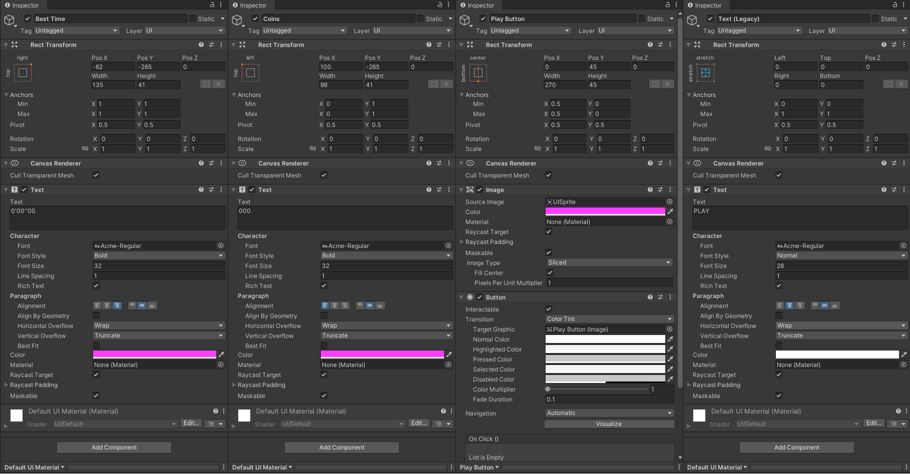
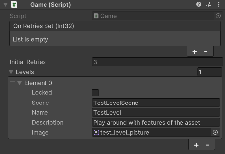

# 游戏界面之关卡选择

我们点击load时，要切换到关卡选择的界面。现在来制作关卡选择的界面。

复制FileSelect场景，将副本命名为LevelSelect

修改Title的内容为：LEVEL SELECT

修改Description的内容为：Choose where to go next and collect all the stars

在Canvas下新建空物体，命名为Level List，并将Scroll View拖到其下方作为子物体。

去除ScrollView上的UISaveList脚本。

在Canvas下新建一个Button Legacy，命名为 Back Button，删除子物体，并添加一张图片作为子物体。按照如图所示调整参数。



打开预制体文件夹，复制UISaveCard，并将副本命名为UILevelCard。\
打开预制体，删除LevelCard下所有子物体，并重新添加如图所示：








保存预制体。打开_GAME_预制体，修改_GAME_下的脚本如图所示：



修改其下的Canvas中的 Sort Order 为 100

修改Flash的颜色，将alpha调为0

将Fader和Loading Screen失活，保存预制体。

---

既然要切换到下一个场景了，那么就需要实现UISaveCard中的Load按钮触发的函数。

打开UISaveCard

```csharp
public virtual void Load()
{
    // 我们要去Game中实现这个函数
    Game.instance.LoadState(m_index, m_data);
    // 随后切换下一个场景
    GameLoader.instance.Load(nextScene);
}
```

打开Game

```csharp
// 从存档中读取出的一些数据
protected int m_dataIndex;
protected DateTime m_createAt;
protected DateTime m_updateAt;

public virtual void LoadState(int index, GameData data)
{
    m_dataIndex = index;
    m_retries = data.retries;
    m_createAt = DateTime.Parse(data.createdAt);
    m_updateAt = DateTime.Parse(data.updateAt);

    for (int i = 0; i < data.levels.Length; i++)
    {
        // 读取存档中打过的关卡
        levels[i].LoadState(data.levels[i]);
    }
}
```

打开GameLevel

```csharp
public virtual void LoadState(LevelData data)
{
    // 读取关卡数据并且赋值
    locked = data.locked;
    coins = data.coins;
    time = data.time;
    stars = data.stars;
}
// 这是格式化显示最佳时间用的函数，一会会用到的。
public static string FormattedTime(float time)
{
    var minutes = Mathf.FloorToInt(time / 60f);
    var seconds = Mathf.FloorToInt(time % 60f);
    var milliseconds = Mathf.FloorToInt((time / 100f) % 100);
}
```

在Scripts\UI下新建脚本UILevelList

```csharp
// 和UISaveList很像
public class UILevelList : MonoBehaviour
{
    public bool focusFirstElement = true;
    public UILevelCard card;
    public RectTransform container;
    protected List<UILevelCard> m_cardList = new List<UILevelCard>();
    
    protected void Awake()
    {
        var levels = Game.instance.levels;

        for (int i = 0; i < levels.Count; i++)
        {
            // 把关卡卡片都加到列表里面去
            m_cardList.Add(Instantiate(card, container));
            m_cardList[i].Fill(levels[i]);
        }
        // 是否选择第一个按钮
        if (focusFirstElement)
        {
            EventSystem.current.SetSelectedGameObject(m_cardList[0].play.gameObject);
        }
    }
}
```

在UI下新建脚本UILevelCard

```csharp
public class UILevelCard : MonoBehaviour
{
    // 预制体中的文本，我们需要改变它们
    public Button play;
    public Text title;
    public Text description;
    public Text coins;
    public Text time;
    public Image Image;
    public Image[] starsImages;
    public string scene { get; set; }
    // 是否被锁住
    protected bool m_locked;

    public bool locked
    {
        get { return m_locked; }
        set
        {
            m_locked = value;
            play.interactable = !m_locked;
        }
    }
    // Play按钮点击后要进入实际的游戏场景了
    public virtual void Play()
    {
        GameLoader.instance.Load(scene);
    }
    // 同样的，要把获取到的关卡数据填充到卡片上显示
    public virtual void Fill(GameLevel level)
    {
        if (level != null)
        {
            locked = level.locked;
            scene = level.scene;
            title.text = level.name;
            description.text = level.description;
            // 格式化最佳时间显示的方式
            time.text = GameLevel.FormattedTime(level.time);
            coins.text = level.coins.ToString("000");
            Image.sprite = level.image;
            for (int i = 0; i < starsImages.Length; i++)
            {
                starsImages[i].enabled = level.stars[i];
            }
        }
    }
    
    protected void Start()
    {
        // 给按钮加监听函数
        play.onClick.AddListener(Play);
    }
}
```

别忘了将场景添加到Build Setting里面。

运行游戏，就能从主界面一路切换到游戏场景了。

打开场景LevelSelect，选择Canvas -> Level LIst -> Scroll View -> Viewport -> Content，将最下方的Content Size Fitter -> Vertical Fit修改为Unconstrained。然后修改Horizontal Layout Group -> Padding -> Top 为 40.

打开Level List，修改最上方的Height为420
