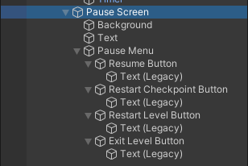
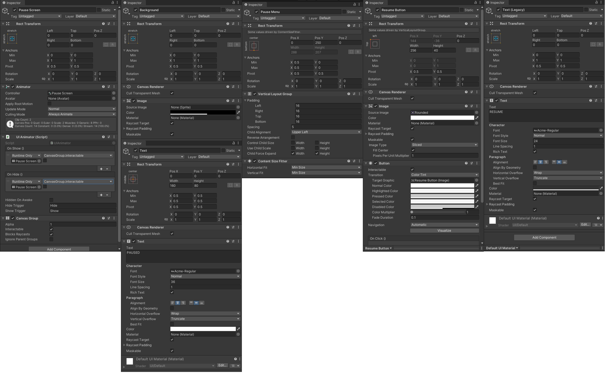

# 游戏界面之场景内界面

打开TestLevelScene，将_LEVEL_下的HUD拖成预制体，保存在Prefabs/UI下。

将_CAMERA_，_LEVEL_拖为预制体，保存在Global下。

给场景中添加_GAME_预制体。

打开_LEVEL_预制体，在Canvas下创建空物体，命名为 Pause Screen。向其中添加组件并设置按如图所示：





**这里有个Bug，图里面Pause Screen 中的 UIAnimator 的 OnShow 事件设置 CanvasGroup.interactable 属性要打勾**

剩余的Restart按钮、Exit按钮均通过复制Resume按钮改名得到。

将Restart Checkpoint Button的文本内容改成 Restart Checkpoint

将Restart Level Button 的文本内容改成 Restart Level

将Exit Level Button 的文本内容改成 Exit

然后将Pause Screen拖为预制体保存在Prefabs/UI下，随后在_LEVEL_中将其失活。

---

Level中当然需要脚本进行控制。在Scripts\Level下新建脚本LevelController，继承MonoBehaviour

要被控制的是我们的暂停界面，所以还需要新建脚本LevelPauser

```csharp
public class LevelPauser : Singleton<LevelPauser>
{
    // 这个时候能不能暂停
    public bool canPause { get; set; }
    // 是否已经暂停了
    public bool isPaused { get; protected set; }
    // 暂停时弹出的暂停界面是哪一个，在Unity里面拖给他
    public UIAnimator pauseScreen;
    // 暂停时和恢复时发送的事件
    public UnityEvent OnPause;
    public UnityEvent OnResume;
    // 暂停操作
    public virtual void Pause(bool value)
    {
        // 如果输入的值和是否暂停的值不同，才需要改变状态
        if (isPaused != value)
        {
            // 如果没有暂停，那就是要暂停
            if (!isPaused)
            {
                // 先解锁鼠标，因为在游戏中鼠标是要被锁住的
                Game.LockCursor(false);
                // 切换暂停状态标记
                isPaused = true;
                // 暂停
                Time.timeScale = 0;
                // 激活暂停窗口
                pauseScreen.SetActive(true);
                // 发送暂停窗口显示时的事件
                pauseScreen?.Show();
                OnPause?.Invoke();
            }
            else // 否则就是要取消暂停
            {
                // 先锁定鼠标
                Game.LockCursor();
                // 恢复状态
                isPaused = false;
                Time.timeScale = 1;
                pauseScreen?.Hide();
                OnResume?.Invoke();
            }
        }
    }
}
```

我们打开Game脚本

```csharp
public static void LockCursor(bool value = true)
{
    // 平台的判断，在pc上才有鼠标
    #if UNITY_STANDALONE
        Cursor.visible = !value;
        Cursor.lockState = value ? CursorLockMode.Locked : CursorLockMode.None;
    #endif
}
```

那么在关卡一开始的时候，我们就需要对鼠标进行锁定，因为在选择关卡的时候就要用到鼠标，但进入游戏场景后就不能让鼠标再显示了，所以要在游戏开始时处理一些东西，就需要创建一个新的脚本。\
在Scripts\Level下新建脚本 LevelStarter

```csharp
public class LevelStarter : Singleton<LevelStarter>
{
    // 在游戏开始时，需要将玩家定身不能操作一段时间，这里就是时间长短
    public float enablePlayerDelay = 1f;
    // 关卡开始的时候发送的事件
    public UnityEvent OnStart;
    // 获取游戏暂停的单例
    protected LevelPauser m_pauser => LevelPauser.instance;
    // 因为我们要在游戏开始时控制玩家的操作，所以就要控制Player，那么需要一个level脚本获取到Player
    protected Level m_level => Level.instance;
    // 游戏当然需要计分，所以也需要计分的工具
    protected LevelScore m_score => LevelScore.instance;

    protected virtual IEnumerator Routinue()
    {
        // 首先要锁住鼠标，因为已经进入关卡了
        Game.LockCursor();
        // 然后让玩家的操作失效，在刚开始这段时间内让玩家定身
        m_level.player.controller.enabled = false;
        m_level.player.inputs.enabled = false;
        // 经过等待的时间，也就是让场景中的所有东西都准备好了之后
        yield return new WaitForSeconds(enablePlayerDelay);
        // 让计分器开始计时
        m_score.stopTime = false;
        // 恢复玩家的操作
        m_level.player.controller.enabled = true;
        m_level.player.inputs.enabled = true;
        // 此时就是能暂停的了
        m_pauser.canPause = true;
        // 发送游戏开始的事件
        OnStart?.Invoke();
    }
    // 需要在start里面新建一个携程去处理相关的逻辑
    protected void Start()
    {
        StartCoroutine(Routinue());
    }
}
```

那么我们需要一个 Level单例，还需要一个LevelScore单例。

所以在Scripts\Level下新建这两个脚本。

在Level中：

```csharp
public class Level : Singleton<Level>
{
    // 通过Level来获取player
    protected Player m_player;

    public Player player
    {
        get
        {
            if (!m_player)
            {
                m_player = FindObjectOfType<Player>();
            }

            return m_player;
        }
    }
}
```

在LevelScore中

```csharp
public class LevelScore : Singleton<LevelScore>
{
    // 是否开始计时
    public bool stopTime { get; set; } = true;
}
```

那么现在暂停相关的方法是有了，那么谁来控制它们呢？

打开PlayerInputManager，我们需要在InputAction里面添加上Pause相关的操作。

```csharp
protected InputAction m_pause;

protected virtual void CacheActions()
{
    m_movement = actions["Movement"];
    m_run = actions["Run"];
    m_jump = actions["Jump"];
    m_look = actions["Look"];
    // 加上暂停的按键
    m_pause = actions["Pause"];
}
```

如果你使用了项目中给定的InputActions配置文件，就不用在里面添加了，如果没使用，就需要在里面绑定对应的按键。

在Scripts\Player下新建脚本 PlayerLevelPause。因为暂停的操作是玩家通过键盘输入进来的，所以需要通过player对象进行操作。

```csharp
public class PlayerLevelPause : MonoBehaviour
{
    protected Player m_player;
    protected LevelPauser m_pauser;

    protected void Start()
    {
        // 初始化这些对象
        m_player = GetComponent<Player>();
        m_pauser = LevelPauser.instance;
    }
    // 需要每帧的检测是否按下了暂停键
    protected virtual void Update()
    {
        if (m_player.inputs.GetPauseDown())
        {
            // 如果按了暂停键，那就要暂停，反之就是取消暂停，这时就用到了上面的Pause函数
            var value = m_pauser.isPaused;
            m_pauser.Pause(!value);
        }
    }
}
```

打开PlayerInputManager

```csharp
public virtual bool GetPauseDown()
{
    // 返回是否按下
    return m_pause.WasPressedThisFrame();
}
```

打开Lily预制体，挂上PlayerLevelPause脚本。

打开_LEVEL_预制体，将PauseScreen拖给右边的LevelPauser脚本。

打开PauseScreen预制体，将Animator -> Update Mode 调整为UnscaledTime。因为暂停的时候TimeScale设置为0，为了让暂停界面正常播放，所以要这样设置。

这里还有个bug，如果再次按下esc让游戏恢复，会发现暂停菜单没有完全退出屏幕。这是因为在PauseScreen动画里面有个数值设置错了。打开Animations -> UI -> Pause Screen -> Hide，在0：15的时候要将Pause Menu的值设置为-200，因为-20就是在屏幕内，我们也没有对它进行失活的处理，所以要设置的远一点