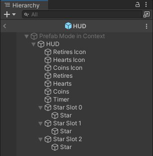
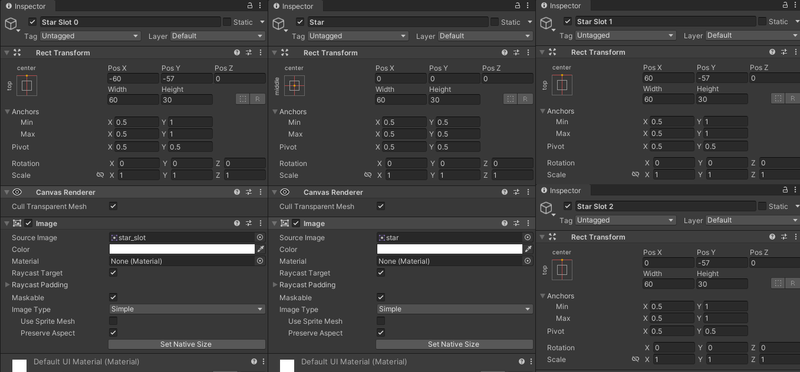

# 游戏界面之数据显示

这里提前将ItemBox中的金币拖出，单独称为一个预制体。

复制金币预制体，关闭脚本中的选项Hidden，就是不隐藏的金币，所以可以有两个这样的预制，之后制作飘在空中的那种金币的时候可以用到。

打开隐藏金币预制体，给它加上LevelController脚本，然后在OnCollect事件中添加一个事件，再将它本身拖给这个事件，调用AddCoins函数。

打开LevelController

```csharp
public class LevelController : MonoBehaviour
{
    // 金币数量当然要存储在计分器里面
    protected LevelScore m_score => LevelScore.instance;
    
    public virtual void AddCoins(int amount)
    {
        m_score.coins += amount;
    }
}
```

打开LevelScore

```csharp
// 每一关只可能有一个计分器，所以是单例
public class LevelScore : Singleton<LevelScore>
{
    // 暂停的时候计时要停止，所以设置了这样的属性
    public bool stopTime { get; set; } = true;
    // 金币数量
    protected int m_coins;
    // 星星数量
    protected bool[] m_stars = new bool[GameLevel.StarsPerLevel];
    
    protected Game m_game;
    protected GameLevel m_level;
    // 状态改变时的事件
    public UnityEvent<int> OnCoinsSet;
    public UnityEvent<bool[]> OnStarsSet;
    // 进入关卡后才会装载LevelScore，我们要通过这里面的监听改变数据，所以一定要等到LevelScore装载后才能用，那就需要事件来通知其他地方这里是否装载完毕了
    public UnityEvent OnScoreLoaded;
    // 获取金币，改变金币数量。改变金币数量时会发生一些事件（比如UI显示的数量改变），所以发送事件
    public int coins
    {
        get { return m_coins; }
        set
        {
            m_coins = value;
            OnCoinsSet?.Invoke(m_coins);
        }
    }
    // 外部要获取星星到底有多少的时候调用的
    public bool[] stars => (bool[]) m_stars.Clone();
    
    public float time { get; protected set; }
    // 那么在开始的时候就装载它
    protected virtual void Start()
    {
        m_game = Game.instance;
        // 我们需要知道当前在哪一关里面
        m_level = m_game?.GetCurrentLevel();
        // 如果确实是在关卡场景里面了
        if (m_level != null)
        {
            // 把星星的数据拿到
            m_stars = (bool[]) m_level.stars.Clone();
        }
        // 通知装载完了
        OnScoreLoaded?.Invoke();
    }
}
```

打开Game

```csharp
public virtual GameLevel GetCurrentLevel()
{
    // 这里课里面每写咋加上去的，实际上在GameLoader里面加了一句话
    var scene = GameLoader.instance.currentScene;
    return levels.Find((level) => level.scene == scene); 
}
```

在GameLoader中

```csharp
public string currentScene => SceneManager.GetActiveScene().name;
```

回到隐藏金币的预制体中，这时设置OnCollect事件发生的时候要调用AddCoins函数，加金币的数量设置为1

那么金币的数量加了，我们要显示到UI上面去，那就需要在HUD上面进行操作

打开HUD脚本

```csharp
public class HUD : MonoBehaviour
{
    public string retriesFormat = "00";
    public string heartsFormat = "0";
    public string coinsFormat = "000";

    [Header("UI Elements")] 
    public Text retires;
    public Text health;
    public Text coins;
    public Text timer;
    public Image[] starsImages;

    protected Game m_game;
    protected LevelScore m_score;
    protected Player m_player;
    
    protected float timerStep;
    protected static float timerRefreshRate = 0.1f;
    // 这都很简单，就是给对应的数据显示到HUD上面去
    protected virtual void UpdateCoins(int value)
    {
        coins.text = value.ToString(coinsFormat);
    }
    
    protected virtual void UpdateRetries(int value)
    {
        retires.text = value.ToString(retriesFormat);
    }
    // 血量直接拿player里的血量就行了
    protected virtual void UpdateHealth()
    {
        health.text = m_player.health.current.ToString(heartsFormat);
    }
    // 由于星星传的是bool数组，所以需要遍历，同时事件类型也需要设置为参数为bool[]的，我个人觉得使用整数控制星星会更加直观。
    protected virtual void UpdateStars(bool[] value)
    {
        for (int i = 0; i < starsImages.Length; i++)
        {
            starsImages[i].enabled = value[i];
        }
    }
    // 这里的工作是把时间显示到界面上，显示的是m_score.time
    protected virtual void UpdateTimer()
    {
        // 加上每帧的时间
        timerStep += Time.deltaTime;
        // 时间精确到0.1，所以时间步长大于0.1了才能加上去，不然一直在更改同样的值就没意义了
        if (timerStep >= timerRefreshRate)
        {
            timer.text = GameLevel.FormattedTime(m_score.time);
            // 每更新完时间说明步长已经大于0.1了，给它归零，重新开始计时
            timerStep = 0;
        }
    }
    // 在加完监听后需要刷新一下HUD上面的显示内容，保证HUD上的初始值正确
    public virtual void Refresh()
    {
        UpdateCoins(m_score.coins);
        UpdateRetries(m_game.retries);
        UpdateHealth();
        UpdateStars(m_score.stars);
    }
    // 在刚开始时，我们要初始化一些数据并且加监听
    protected void Awake()
    {
        m_game = Game.instance;
        m_score = LevelScore.instance;
        m_player = FindObjectOfType<Player>();
        // 在计分器加载后，就要给这些具体的数据改变的事件加监听。
        // 那么这里就用到了上面写的，在LevelScore加载完了才能改变这些数据
        m_score.OnScoreLoaded.AddListener(() =>
        {
            m_score.OnCoinsSet.AddListener(UpdateCoins);
            m_score.OnStarsSet.AddListener(UpdateStars);
            m_game.OnRetriesSet.AddListener(UpdateRetries);
            // 血量要抽象出来一个类
            m_player.health.OnChange.AddListener(UpdateHealth);
            Refresh();
        });
    }

    protected virtual void Update()
    {
        // 这里是显示时间的，所以每帧计算一下刷新时间
        UpdateTimer();
    }
}
```

打开Player

```csharp
// 声明这个属性
public Health health { get; protected set; }
// 初始化函数，因为它是个类，必须要初始化
protected virtual void InitializeHealth() => health = GetComponent<Health>();
// 初始化函数要放进awake里面
protected override void Awake()
{
    base.Awake();
    InitializedInputs();
    InitializedStats();
    // 加上这句
    InitializeHealth();
    InitializeTag();
}
```

那么这个类该如何实现？在Scripts\Misc下新建脚本Health

```csharp
public class Health : MonoBehaviour
{
    // 初始默认血量是多少
    public int initial = 3;
    // 最高血量是多少
    public int maxHealth = 3;
    // 血量改变时发送的事件
    public UnityEvent OnChange;
    // 当前血量是多少
    protected int m_currentHealth;
    
    public int current
    {
        get { return m_currentHealth; }
        set
        {
            // 设置当前血量时要看看跟当前的值一样不一样，一样就不设置了
            var last = m_currentHealth;
            if (value != last)
            {
                // 别让血量超出规定范围
                m_currentHealth = Mathf.Clamp(value, 0, maxHealth);
                OnChange?.Invoke();
            }
        }
    }
    // 重置血量
    public virtual void Reset()
    {
        current = initial;
    }

    protected void Awake()
    {
        // 初始化血量
        current = initial;
    }
}
```

打开LevelScore，我们写了显示时间到HUD上的函数，但是时间数据本身没有更新

```csharp
// 每帧更新时间
protected void Update()
{
    if (!stopTime)
    {
        time += Time.deltaTime;
    }
}
```

现在来挂脚本了。

打开Lily预制体，挂上Health脚本。

打开HUD预制体，我们要显示星星，那么就需要把星星的图片弄上去，和LevelCard里面一样的。



都是复制的，只放出来改变的数据



HUD脚本中，将StarsImages数组长度设置为3，然后将星星图片拖上去。注意拖的时Star，不是Star Slot

现在运行，吃金币就能显示了，时间也会增加了