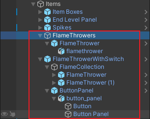
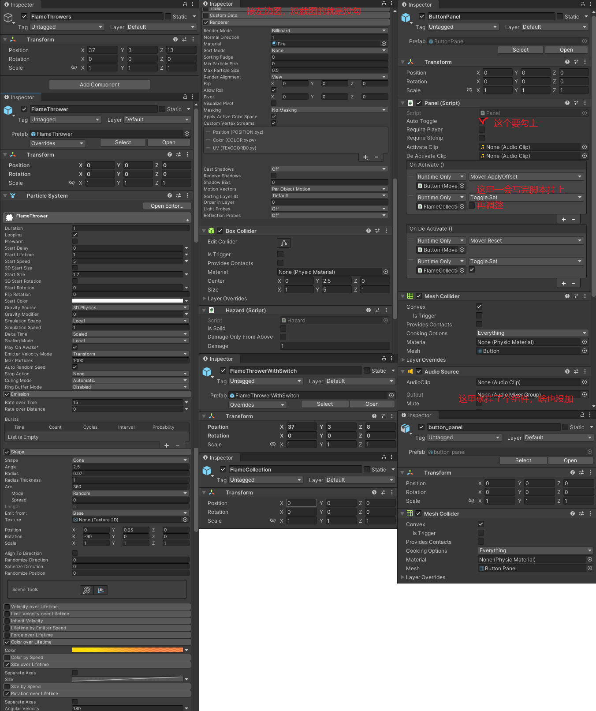
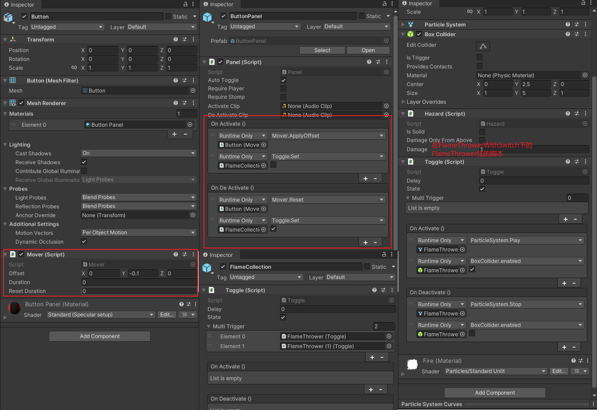
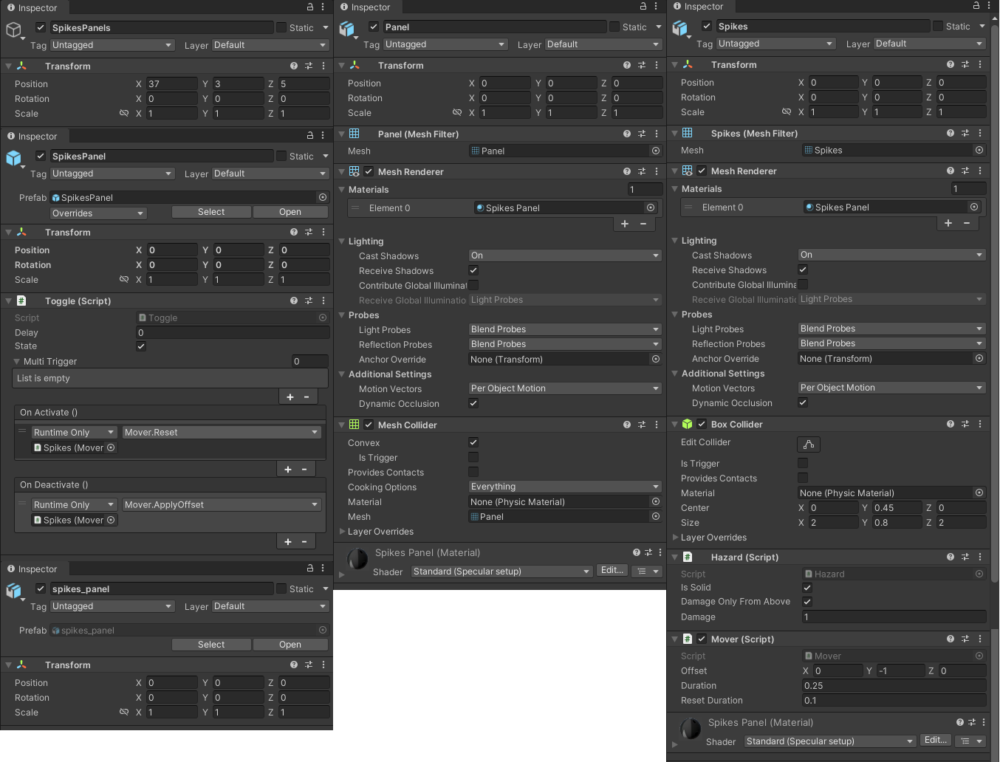

# 火焰陷阱

做喷火陷阱了

就是场景里面拖拖拖，然后调参数。

这次要制作的东西列表如下：



调整参数如图：



在Scripts\Misc下新建脚本Mover

```csharp
// 按钮踩下去要移动
public class Mover : MonoBehaviour
{
    // 移动的距离
    public Vector3 offset;
    // 移动的时间
    public float duration;
    // 恢复的时间
    public float resetDuration;
    // 初始的位置
    protected Vector3 m_initialPosition;

    protected virtual IEnumerator ApplyOffsetRoutine(Vector3 from, Vector3 to, float duration)
    {
        // 已经移动了的时间
        var elapsedTime = 0f;
        while (elapsedTime < duration)
        {
            // 移动的比例
            var t = elapsedTime / duration;
            // 插值运算，从起始点到结束点，按比例移动
            transform.localPosition = Vector3.Lerp(from, to, t);
            elapsedTime += Time.deltaTime;
            yield return null;
        }
        // 最后到达目的地
        transform.localPosition = to;
    }
    
    public virtual void ApplyOffset()
    {
        StopAllCoroutines();
        StartCoroutine(ApplyOffsetRoutine(m_initialPosition, m_initialPosition + offset, duration));
    }

    public virtual void Reset()
    {
        StopAllCoroutines();
        // 开启携程移动按钮
        StartCoroutine(ApplyOffsetRoutine(transform.localPosition, m_initialPosition, resetDuration));
    }
    
    protected void Start()
    {
        // 初始化初始位置，别写错了，世界坐标的话按钮就飞了，因为后面处理的都是本地坐标
        m_initialPosition = transform.localPosition;
    }
}
```

在Misc下新建脚本Toggle

```csharp
// 踩了按钮要触发一些东西，在这里触发
public class Toggle : MonoBehaviour
{
    // 触发延迟是多少
    public float delay;
    // 触发状态
    public bool state = true;
    // 如果需要控制多个触发器，就通过这个列表管理
    public Toggle[] multiTrigger;
    // 触发时发送事件
    public UnityEvent OnActivate;
    // 关闭时发送事件
    public UnityEvent OnDeactivate;
    // 为了避免递归死循环调用，我这里加了一个判断条件，用来判断当前物体的toggle携程是否在运行
    protected bool m_isRunning = false;

    protected virtual IEnumerator SetRoutine(bool value)
    {
        yield return new WaitForSeconds(delay);
        
        // 判断的逻辑我就不多说了，主要是递归的逻辑

        if (value)
        {
            if (!state)
            {
                state = true;

                // 循环遍历列表里面物体的toggle，并修改它们的状态
                foreach (var toggle in multiTrigger)
                {
                    // 注意，这里开启的是列表里面物体的toggle携程，和我们正在运行的这个携程没有关系，set方法里面的 停止所有携程 不会影响到我们这里运行的这个携程。
                    toggle.Set(state);
                }
                
                OnActivate?.Invoke();
            }
        }
        else if (state)
        {
            state = false;
            
            foreach (var toggle in multiTrigger)
            {
                toggle.Set(state);
            }
            
            OnDeactivate?.Invoke();
        }
        m_isRunning = false;
    }
    // 这个m_isRunning是防啥的呢？假如你在场景里挂脚本，在A物体上面加了toggle，列表里面包含B物体，然后B物体上也挂了Toggle，里面列表包含A物体，就会循环调用。虽然可以在拖拽的时候避免这个问题，但是你防不住粗心，所以在这里加一个条件，如果A物体的Toggle携程正在运行的时候，B物体就不能修改它的状态。
    public void Set(bool value)
    {
        if (!m_isRunning)
        {
            m_isRunning = true;
            StopAllCoroutines();
            // 开启携程，开启的是挂载这个脚本的物体的携程
            StartCoroutine(SetRoutine(value));
        }
    }
}
```

ok，进入场景，挂脚本。



运行进入场景，踩按钮火停止喷，松开继续喷。

别忘了拖成预制体保存。

同样的，还能制作一个开关地刺。


地刺的组件如图挂载：



开关地刺的制作和火焰喷射一样，要注意事件监听到底监听谁，还有本地坐标的问题也需要注意。