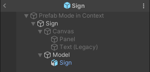
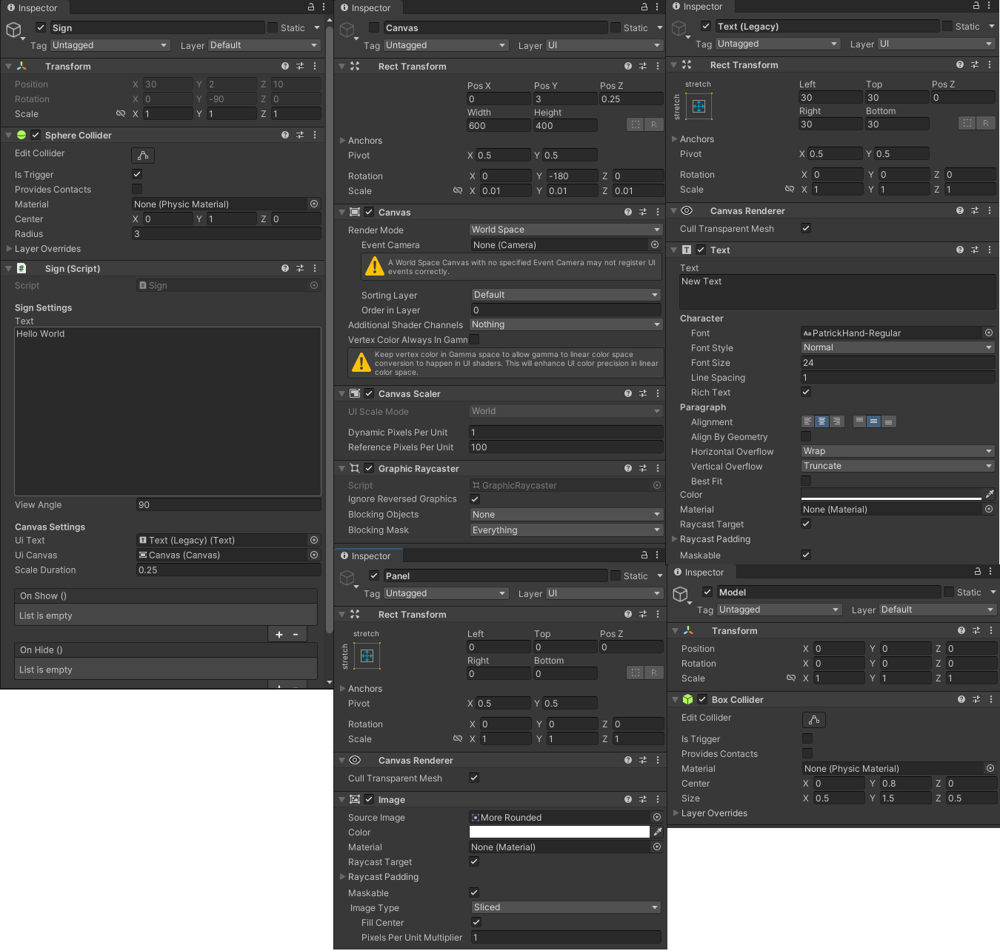

# 公告板

场景中拖物体如图：



属性设置如下：



在Scripts\Misc下新建脚本 Sign

```csharp
[RequireComponent(typeof(Collider))]
public class Sign : MonoBehaviour
{
    [Header("Sign Settings")] 
    [TextArea(15, 20)] // 设置一下在Inspector窗口里面文字框的大小
    public string text = "Hello World";
    public float viewAngle = 90f;   // 观察角度，超过90度就不给你看了
    [Header("Canvas Settings")] 
    public Text uiText;
    public Canvas uiCanvas;
    public float scaleDuration = 0.25f;

    [Space(15)] // inspector窗口里面留点空隙
    public UnityEvent OnShow;
    public UnityEvent OnHide;
    
    protected Vector3 m_initialScale;
    protected bool m_showing;
    protected Collider m_collider;
    protected Camera m_camera;
    
    
    
    protected void Awake()
    {
        // 初始化
        uiText.text = text;
        m_initialScale = uiCanvas.transform.localScale;
        uiCanvas.transform.localScale = Vector3.zero;
        uiCanvas.gameObject.SetActive(true); // 让canvas缩放为0，但是是active的
        m_collider = GetComponent<Collider>();
        m_camera = Camera.main;
    }

    public virtual void Show()
    {
        if (!m_showing)
        {
            m_showing = true;
            
            OnShow?.Invoke();
            StopAllCoroutines();
            StartCoroutine(Scale(Vector3.zero, m_initialScale));
        }
    }

    public virtual void Hide()
    {
        if (m_showing)
        {
            m_showing = false;
            
            OnHide?.Invoke();
            StopAllCoroutines();
            StartCoroutine(Scale(m_initialScale, Vector3.zero));
        }
    }

    protected virtual IEnumerator Scale(Vector3 formScale, Vector3 toScale)
    {
        // 循环每次插值增大这个scale
        float elapsedTime = 0;
        var scale = uiCanvas.transform.localScale;

        while (elapsedTime < scaleDuration)
        {
            scale = Vector3.Lerp(formScale, toScale, (elapsedTime / scaleDuration));
            uiCanvas.transform.localScale = scale;
            elapsedTime += Time.deltaTime;
            yield return null;
        }
        
        uiCanvas.transform.localScale = toScale;
    }
    // 人走出这个碰撞范围的时候要隐藏
    protected void OnTriggerExit(Collider other)
    {
        if (other.CompareTag(GameTags.Player))
        {
            Hide();
        }
    }
    // 人待在碰撞范围内时
    protected void OnTriggerStay(Collider other)
    {
        if (other.CompareTag(GameTags.Player))
        {
            // 算一下观察角度 和 观察高度
            var direction = (other.transform.position - transform.position).normalized;
            var angle = Vector3.Angle(transform.forward, direction);
            var allowHeight = other.transform.position.y > m_collider.bounds.min.y;
            var inCameraSight = Vector3.Dot(m_camera.transform.forward, transform.forward) < 0;
            // 角度高度都在范围内就显示，否则就隐藏
            if (angle < viewAngle && allowHeight && inCameraSight)
            {
                Show();
            }
            else
            {
                Hide();
            }
        }
    }
}
```

把公告板放到场景里面输入内容，走过去就能看到效果了。