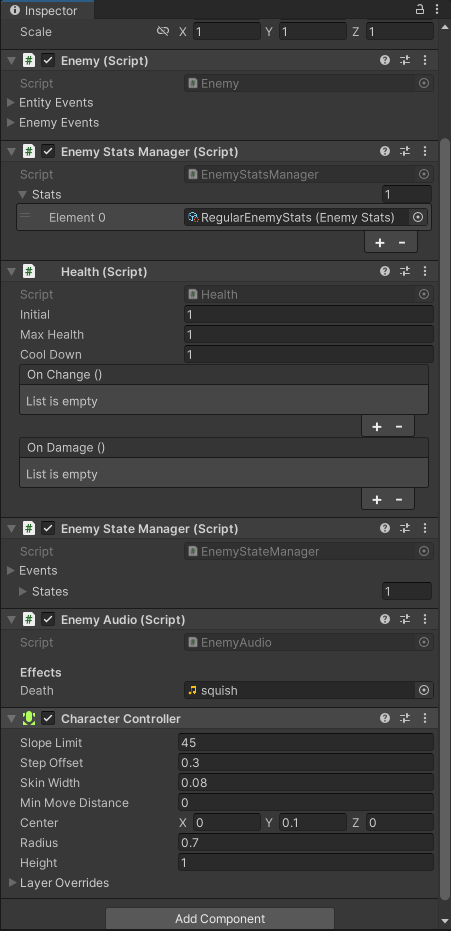
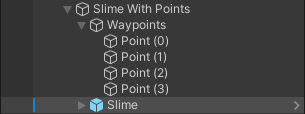
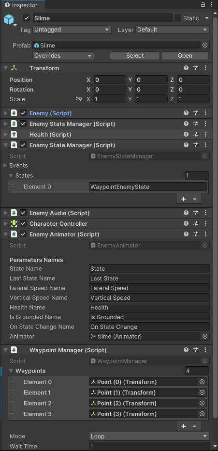

# 怪物状态机

在Enemy下新建脚本 EnemyState，EnemyStateManager，EnemyAudio

EnemyState：

```csharp
public abstract class EnemyState : EntityState<Enemy>
{
}
```

EnemyStateManager：

```csharp
// 和玩家状态机一样，也是通过一个string列表在Inspector窗口里面设置怪物的状态
[RequireComponent(typeof(Enemy))]
public class EnemyStateManager : EntityStateManager<Enemy>
{
    [ClassTypeName(typeof(EnemyState))] 
    public string[] states;

    protected override List<EntityState<Enemy>> GetStateList()
    {
        // 通过反射去创建实例
        return EnemyState.CreateListFromStringArray(states);
    }
}
```

EnemyAudio：

```csharp
public class EnemyAudio : MonoBehaviour
{
    [Header("Effects")] 
    public AudioClip death; // 死亡音效
    
    
    protected Enemy m_enemy;
    protected AudioSource m_audio;
    
    protected virtual void InitializeEnemy()
    {
        m_enemy = GetComponent<Enemy>();
    }

    protected virtual void InitializeAudio()
    {
        // 没有AudioSource就加一个
        if (!TryGetComponent(out m_audio))
        {
            m_audio = gameObject.AddComponent<AudioSource>();
        }
    }

    protected virtual void InitializeCallbacks()
    {
        // 监听死亡，死了就放音效
        m_enemy.enemyEvents.OnDie.AddListener(() => m_audio.PlayOneShot(death));
    }
    
    protected void Start()
    {
        InitializeEnemy();
        InitializeAudio();
        InitializeCallbacks();
    }
}
```

到场景中，给史莱姆预制体挂脚本。



---

然后再制作怪物的动画控制组件

在Enemy下新建脚本 EnemyAnimator

```csharp
// 这个脚本的思路和PlayerAnimator一样，就是把动画机里面实际的变量名称转换成Hash值，通过状态机改变状态来改变动画
[RequireComponent(typeof(Enemy))]
public class EnemyAnimator : MonoBehaviour
{
    [Header("Parameters Names")] 
    public string stateName = "State";
    public string lastStateName = "Last State";
    public string lateralSpeedName = "Lateral Speed";
    public string verticalSpeedName = "Vertical Speed";
    public string healthName = "Health";
    public string isGroundedName = "Is Grounded";
    public string onStateChangeName = "On State Changed";

    protected int m_stateHash;
    protected int m_lastStateHash;
    protected int m_lateralSpeedHash;
    protected int m_verticalSpeedHash;
    protected int m_healthHash;
    protected int m_isGroundedHash;
    protected int m_onStateChangeHash;

    public Animator animator;
    
    protected Enemy m_enemy;
    // 初始化enemy
    protected virtual void InitializeEnemy() => m_enemy = GetComponent<Enemy>();
    // 初始化动画机的hash
    protected virtual void InitializeParametersHash()
    {
        m_stateHash = Animator.StringToHash(stateName);
        m_lastStateHash = Animator.StringToHash(lastStateName);
        m_lateralSpeedHash = Animator.StringToHash(lateralSpeedName);
        m_verticalSpeedHash = Animator.StringToHash(verticalSpeedName);
        m_healthHash = Animator.StringToHash(healthName);
        m_isGroundedHash = Animator.StringToHash(isGroundedName);
        m_onStateChangeHash = Animator.StringToHash(onStateChangeName);
    }
    // 初始化动画机的 初始状态
    protected virtual void InitializeAnimatorTriggers() =>
        m_enemy.states.events.onChange.AddListener(() => animator.SetTrigger(m_onStateChangeHash));
    
    protected void Start()
    {
        InitializeEnemy();
        InitializeParametersHash();
        InitializeAnimatorTriggers();
    }
    // 每帧检测怪物的状态变化
    protected void LateUpdate()
    {
        var lateralSpeed = m_enemy.lateralVelocity.magnitude;
        var verticalSpeed = m_enemy.verticalVelocity.y;
        // 用到的参数都是之前定义好的
        animator.SetInteger(m_stateHash, m_enemy.states.index);
        animator.SetInteger(m_lastStateHash, m_enemy.states.lastIndex);
        animator.SetFloat(m_lateralSpeedHash, lateralSpeed);
        animator.SetFloat(m_verticalSpeedHash, verticalSpeed);
        animator.SetInteger(m_healthHash, m_enemy.health.current);
        animator.SetBool(m_isGroundedHash, m_enemy.isGrounded);
    }
}
```

我们做的这个史莱姆是根据设定的路径点去走的，在几个路径点之间巡逻。\
那么它巡逻可能会有好几个模式，在Waypoint下新建脚本WaypointMode

```csharp
public enum WaypointMode
{
    Loop, // 循环，不断地沿着几个路径点循环移动
    PingPong, // 像乒乓球一样在两个路径点之间来回移动
    Once // 只走一次，从最开始的路径点走到最后的路径点
}
```

打开WaypointManager

```csharp
public class WaypointManager : MonoBehaviour
{
    // 路径点列表
    public List<Transform> waypoints;
    // 巡逻模式
    public WaypointMode mode;
    // 每次巡逻到路径点后等待的时间
    public float waitTime;
    
    protected Transform m_current;
    protected bool m_changing;
    protected bool m_pong;
    public Transform current
    {
        get
        {
            if (!m_current)
            {
                m_current = waypoints[0];
            }

            return m_current;
        }

        protected set { m_current = value; }
    }
    // 当前路径点在列表里的位置
    public int index => waypoints.IndexOf(current);
    // 到下一个路径点
    public virtual void Next()
    {
        // 如果已经在改变路径点了，就不能继续算了
        if (m_changing)
        {
            return;
        }
        // 如果是pingpong模式
        if (mode == WaypointMode.PingPong)
        {
            // false就往第二个点走
            if (!m_pong)
            {
                m_pong = (index + 1 == waypoints.Count);
            }
            else // true就往第一个点走
            {
                m_pong = (index - 1 >= 0);
            }

            var next = !m_pong ? index + 1 : index - 1;
            StartCoroutine(Change(next));
        }
        else if (mode == WaypointMode.Loop)
        {
            // 循环模式，从前到后循环列表，到最后一个的时候next就是0号位置
            if (index + 1 < waypoints.Count)
            {
                StartCoroutine(Change(index + 1));
            }
            else
            {
                StartCoroutine(Change(0));
            }
        }
        else if (mode == WaypointMode.Once)
        {
            // 走一次就从0开始走完列表就完了
            if (index + 1 < waypoints.Count)
            {
                StartCoroutine(Change(index + 1));
            }
        }
    }
    // 携程，改变路径点
    protected virtual IEnumerator Change(int toIndex)
    {
        m_changing = true;
        yield return new WaitForSeconds(waitTime);
        current = waypoints[toIndex];
        m_changing = false;
    }
}
```

当然，史莱姆也有各种状态，我们能在动画机里面看见有三种状态，idle，follow，waypoint。

先来实现最简单的idle，在Enemy下新建文件夹States，新建脚本IdleEnemyState

```csharp
public class IdleEnemyState : EnemyState
{
    protected override void OnEnter(Enemy entity)
    {
    }

    protected override void OnExit(Enemy entity)
    {
    }

    protected override void OnStep(Enemy entity)
    {
        entity.Gravity();
        entity.SnapToGround();
        entity.Friction();
    }

    public override void OnContact(Enemy entity, Collider other)
    {  
    }
}
```

再来实现follow，新建脚本FollowEnemyState

```csharp
public class FollowEnemyState : EnemyState
{
    protected override void OnEnter(Enemy entity)
    {
    }

    protected override void OnExit(Enemy entity)
    {
    }
    // 锁定玩家时，进行follow
    protected override void OnStep(Enemy entity)
    {
        entity.Gravity();
        entity.SnapToGround();
        // 算出玩家在哪个方向
        var head = entity.player.position - entity.position;
        var direction = new Vector3(head.x, 0, head.z).normalized;
        // 朝着玩家方向前进
        entity.Accelerate(direction, entity.stats.current.followAcceleration, entity.stats.current.followTopSpeed);
        entity.FaceDirectionSmooth(direction);
    }

    public override void OnContact(Enemy entity, Collider other)
    {
    }
}
```

巡逻模式，新建脚本WaypointEnemyState

```csharp
public class WaypointEnemyState : EnemyState
{
    protected override void OnEnter(Enemy entity)
    {
        
    }

    protected override void OnExit(Enemy entity)
    {
        
    }

    protected override void OnStep(Enemy entity)
    {
        entity.Gravity();
        entity.SnapToGround();
        // 目的地就是 当前的路径点
        var destnation = entity.waypoints.current.position;
        // 拿到当前路径点的坐标信息，y值重设为怪物的y值，不然y值不同怎么样都到不了目的地，就卡住了
        destnation = new Vector3(destnation.x, entity.position.y, destnation.z);
        // 前进方向（向量长度要注意）
        var head = destnation - entity.position;
        // 前进距离
        var distance = head.magnitude;
        // 前进方向的单位向量
        var direction = head / distance;
        // 如果 到了路径点了
        if (distance <= entity.stats.current.waypointMinDistance)
        {
            // 减速，换目标到下一个路径点
            entity.Decelerate();
            entity.waypoints.Next();
        }
        else // 没到路径点的时候
        {
            // 朝路径点前进
            entity.Accelerate(direction, entity.stats.current.waypointAcceleration, entity.stats.current.waypointTopSpeed);
            // 如果没有朝向路径点，就改变怪物朝向
            if (entity.stats.current.faceWayPoint)
            {
                entity.FaceDirectionSmooth(direction);
            }    
        }
    }

    public override void OnContact(Enemy entity, Collider other)
    {
        
    }
}
```

给史莱姆设置路径点，就是空节点



然后挂脚本，如图填写参数



此时运行，史莱姆就能自动在路径点之间走路了。

由于我们的史莱姆发现并跟随玩家是发送事件来做之后的动作的，所以现在还要在EntityStateManager中加上一个函数：

```csharp
// 就是根据状态在数组中的下标进行切换的
public virtual void Change(int toState)
{
    if (toState >= 0 && toState < m_list.Count)
    {
        Change(m_list[toState]);
    }
}
```

那么在Unity中，打开挂在史莱姆身上的EnemyStateManager，在其中再加上FollowEnemyState。\
同时再去上面的Enemy脚本里面，给OnPlayerSpotted事件加监听，就执行我们上面写的这个Change函数，参数填1\
OnPlayerScaped也监听，同样执行Change，参数填0

其实我觉得这个怪物状态机还是有一定缺陷的，如果我这时候想再加个别的什么怪物，它的逻辑跟史莱姆不太一样的话，这一堆管理类又得重新写。